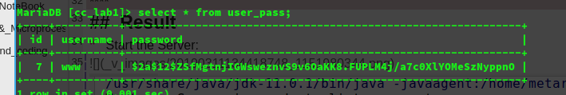

Cloud Computing Lab 1

姓名：汪至圆 &nbsp; 学号11610634

****
##  Design
### Module Design:

*   Server Part
    *   In the Server part, I have design an interface and three classes. They will bind the server to the port we want and provide the class that the Client need.
*   Client Part:
    *   In the Client part, it just have a class Client to connect to the server and do the operation about login and register.
    *   First, it will get a object from server.
    *   Then, it will enter a loop and need to choice the function
    *   If choice login, you need input username and password, then use the method of the remote object and get the result.
    *   If choice register, you need input username and password, then use the method of the remote object to register and get the result.
    *   If choice exit, will exit the Client.

### Class Design:

*   Server Part
    *   The interface is the model, which will be transfered remoted by the client.
    *   One class is Server, it was used to bind the Server to one port and create an instance of the model used to be transfered by the client.
    *   One class is modelImpl, an inplenment of the model. It will process the client input and translate it to the Clear text or Ciphertext.
    *   The last class is JDBC, it including all the operation detail to the database, and it will encrypt the password before store it into the database.
    *   And  I also use a class called BCrypt which writen by Damien Miller, it was used to encrypt the password and check the password.
*   Client part:
    *   In the Client part, there is just a class called Client, it just used to do the process for the logic of the operation on the client and get thr remote object from server.

****
##  Problem
*   When I work for the password encrypting, I found that the byte[] after encrypting can't be coded to a string whether I use AES or RSA, it won't be a big problem when I transfer the data from client to server, I can transfer the byte array, but the byte array can't be storaged in the database, and if I storage the password in the database as clear text, it's so dangerous.
    *   Solution: I found a new way to encode the password, it was the class that I have mentioned above, the BCrypt. BCrypt is a Java™ implementation of OpenBSD's Blowfish password hashing code, it can transfer the translate the password to a Ciphertext.

*   When I run all the program, the server didn't work and it will throws NoClassDefException
    *   Solution: Set the ClassPath, add the path of lib jar of jdk and jar into the ClassPath, add the path of Mysql driver jar into the Classpath

****
##  Result
*   Start the Server:
    

*   Start the Client:
    

*   Register:
    
    

*   Try this name again:
    

*   Login Successfully:
    

*   Login with wrong password:
    

*   Login with a username that don't exist:
    
