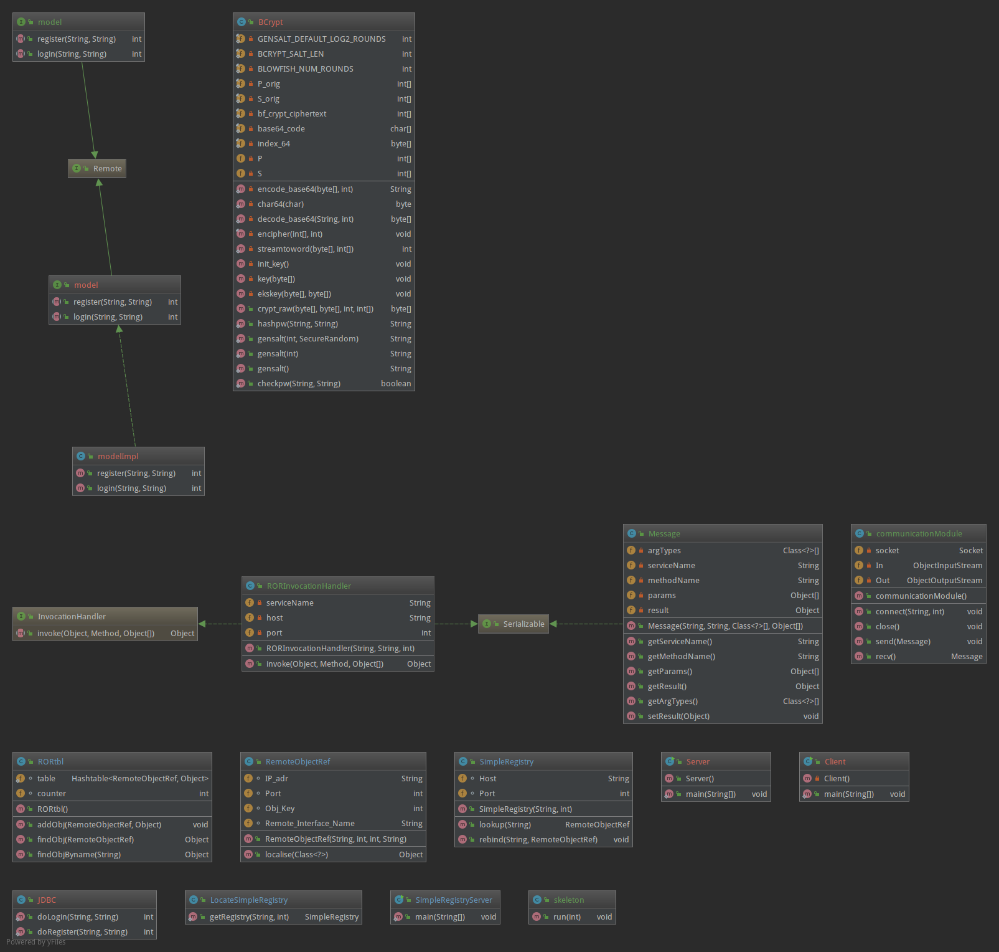
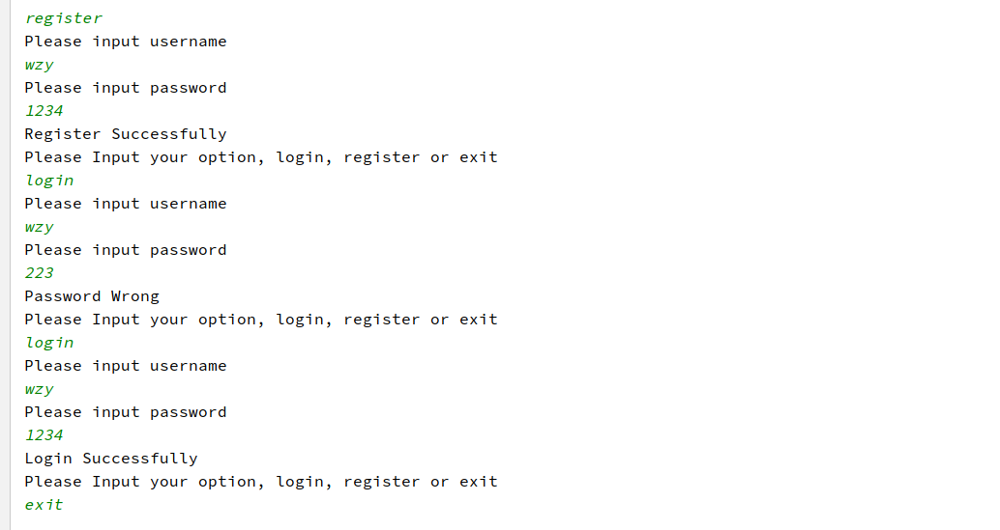
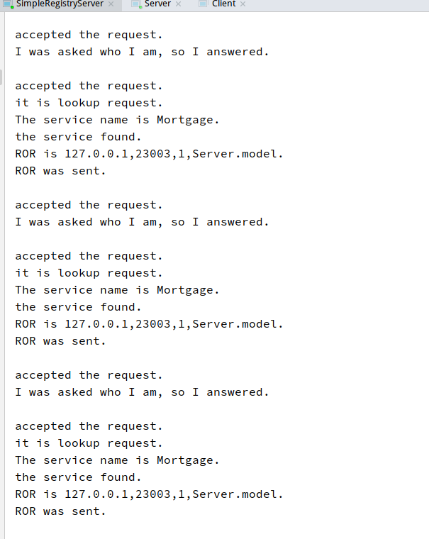

Cloud Computing Lab 2

姓名：汪至圆 &nbsp; 学号11610634

****
##  Design
*   RMI Part
    *   Start SimpleRegistryServer, listen to the request from Server and the Client

*   Server Part
    *   Run the server
    *   Generate the ROR
    *   Get a SimpleRegister from LocateSimpleRegistry
    *   Bind to the SimpleRegistryServer.
    
*   Client Part
    *   Run the Client
    *   Get a SimpleRegister from LocateSimpleRegistry
    *   Lookup the ROR by the SimpleRegister from LocateSimpleRegistry
    *   Get stub by using proxy and handle
    *   Execute!

##  Communication Module:
*   Use socket to send and receive the Object.
*   Using Message Class which implenment the Serializable to package the method and argunments.

##  Problem
*   When I get the stub in the Client, I forget add all the code in the try{}catch{} block, then the stub I want to invoke is always null and it throws a NullPointerException.
And I solve this problem by add all the codes in the try{}catch{} block

*   When I run the Client, it exception a InvocationTargetException.
I find it course by the exceptions that throwsed by the method which is invoked.
And the Result is I forget to start the Database Server.

##  Result:

