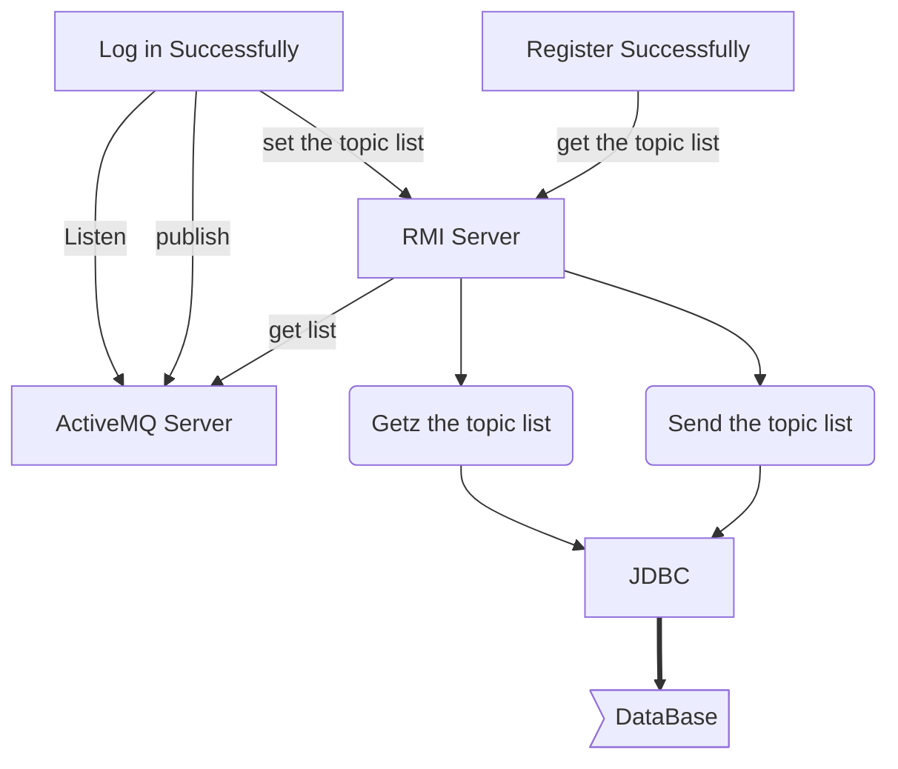
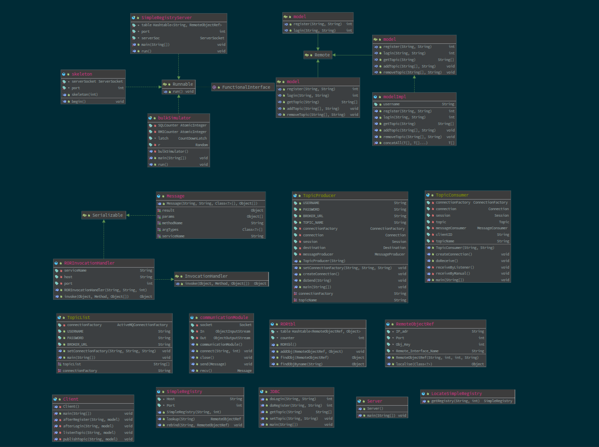
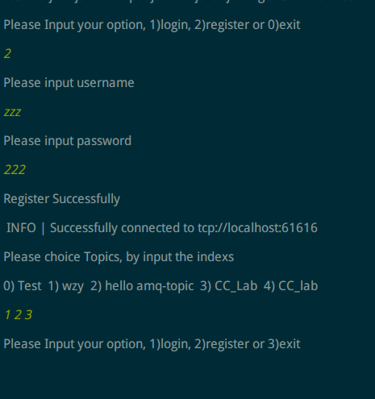
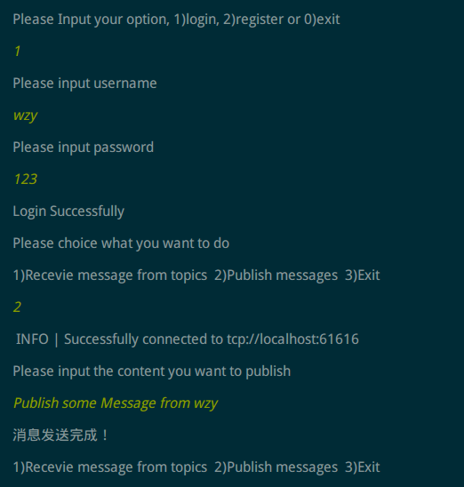
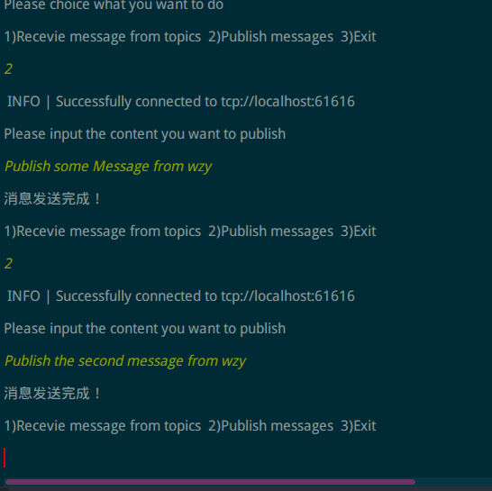
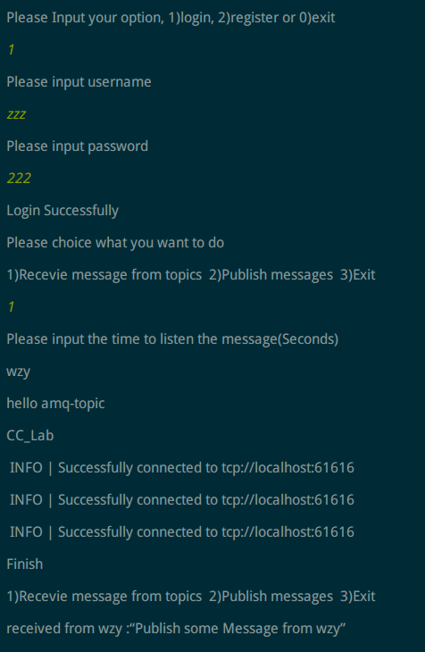
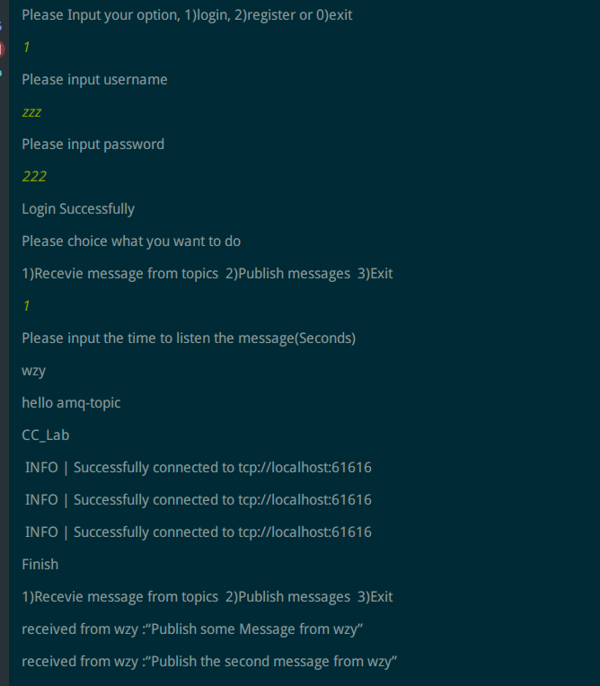
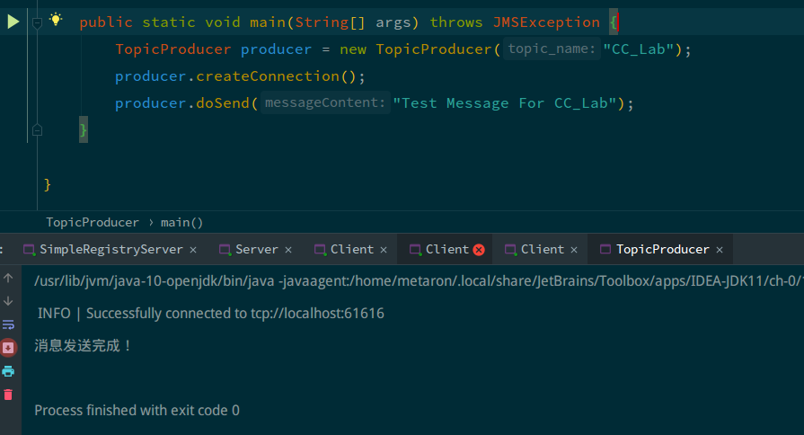
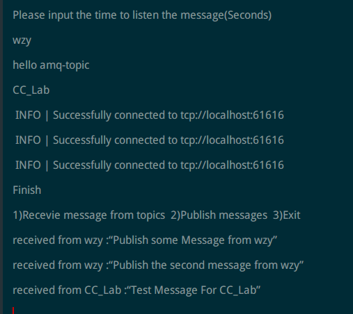
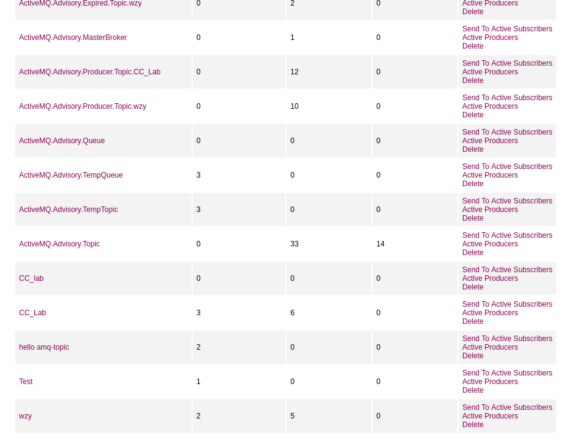

Cloud Computing Lab 4

姓名：汪至圆 &nbsp; 学号11610634

****

#   Design
This Lab is designed base on the Lab1, Lab2 and Lab3. In this Lab, I add function of publish and subscribe topic.
##  Publish:
The client will connect to the Server of activemq, and publish a message to the topic which is named by its name.

##  Subscribe:
The client will connect to the database on the Server by rmi to get the topic list of the user. Then begin to listen the topics it subscribed with the client id is \$USERNAME_\$TOPICNAME

##  Class Design:

#   Problem
1.  The client wont't reveive the message before it begin listen to the topic.  
   Solution: Use $session.createDurableSubscriber()$ to connect to the topic with an client id, then we can receive the messages which is send when we not listen.

#   Result:
*   Add the topic to the topic list of the user when he finish the register.
    
*    The user publish message to the message to the topic with it's name.  
    
*    Listen to the topics which the user subscribe  
    
    
*    Send a message to CC_Lab topic by myself
    
*    The Client reveive the message:
    
*    Web:
    