
Cloud Computing Lab 4

姓名：汪至圆 &nbsp; 学号11610634

---

# Design

This Lab is writen by SpringBoot. I use redis to manage the session. Use the mariadb as the SQL database. And deploy the project on the cloud server. The url of the server is http://149.248.57.243:8088

- Web Structure:

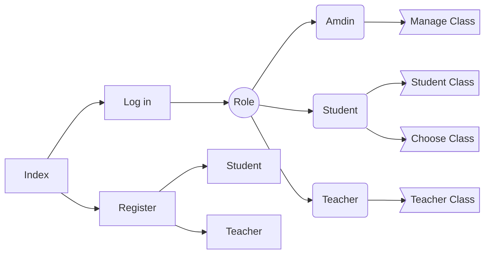

- Class Diagram:
  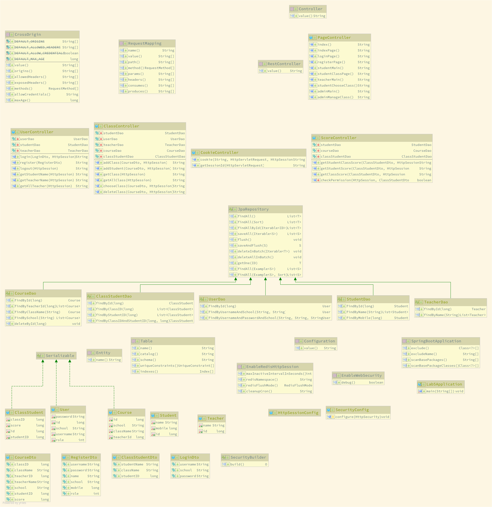

## Back End:

- Use redis to save the session imformation.
  - Use seesion to svae the status of the user
  - Use redis to save the session can improve the performance and can extend to distributed storage easily.
- Use the thymeleaf to return the html page and javascript.
- Use json to return the messages.

## Front End:

- Use original javascript

# Problem

- If I use redis to storage the session, I must use spring-boot-starter-security which need I login the server each time. It was a problem if the usr want to use my website.
  - Solution: Create a class called SecurityConfig which extends WebSecurityConfigurerAdapter. And override the method configure to permit all request in.

# Result:

- Index:
  - 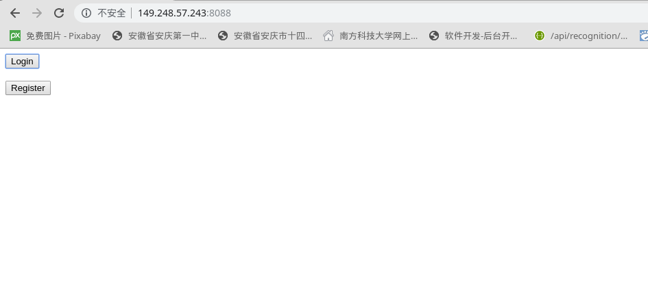
- Register:
  - 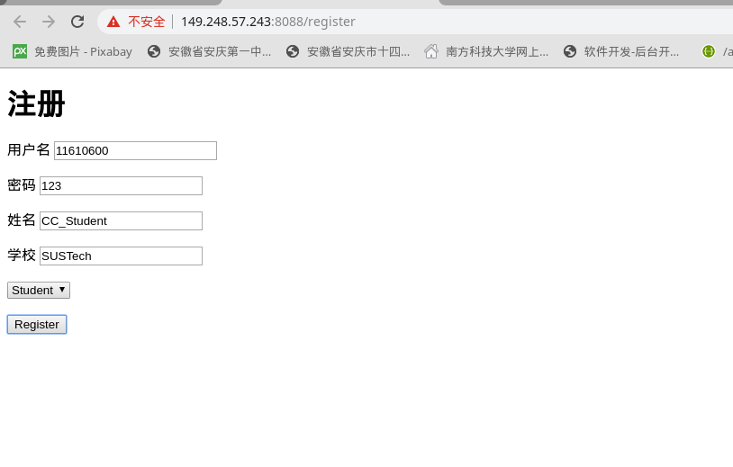
- Login:
  - 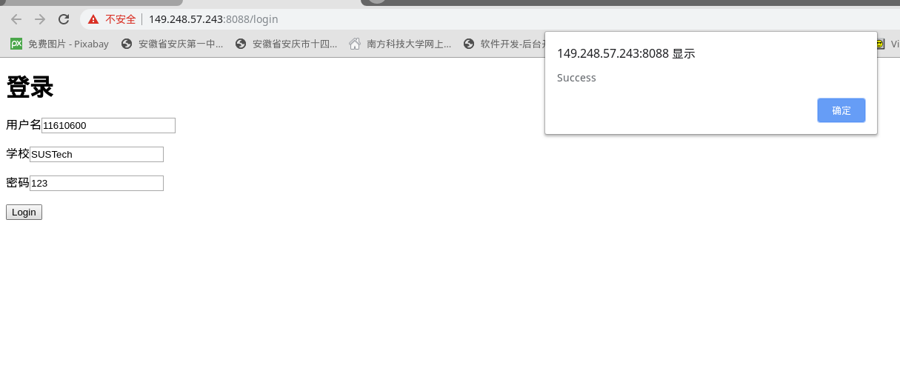
- Admin:
  - login:
    - 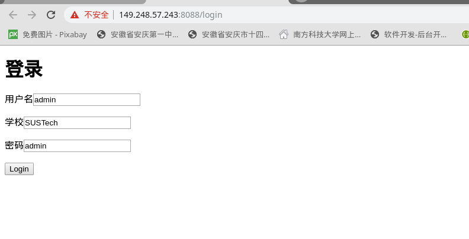
  - Class Manage:
    - 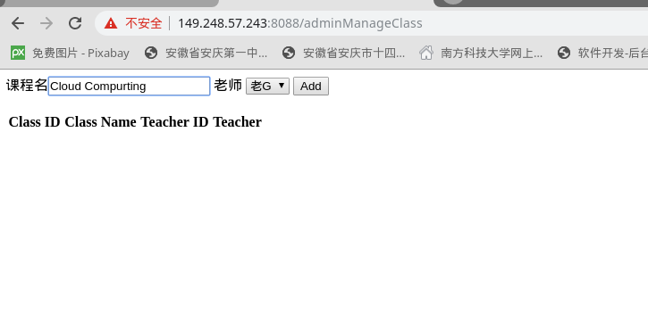
    - 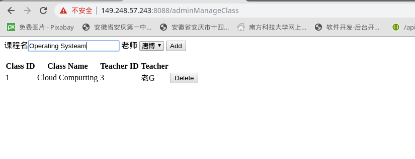
    - 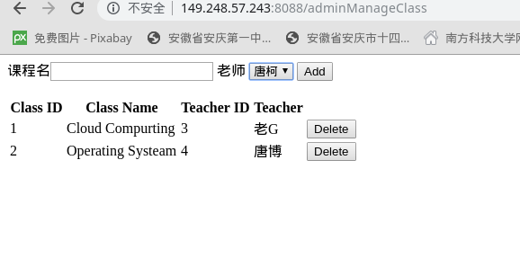
- Student:
  - Choose Class:
    - 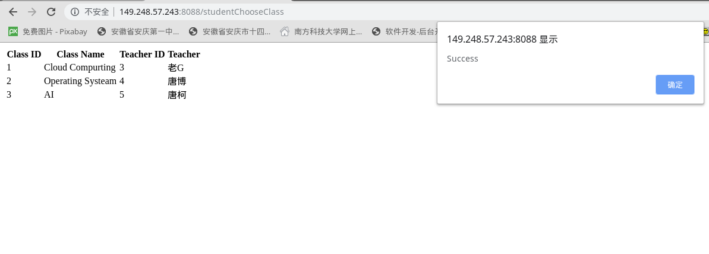
  - Student Class:
    - 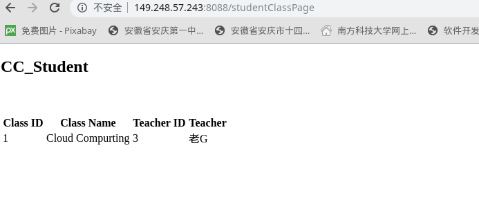
- Teacher:
  - Teacher Class:
    - 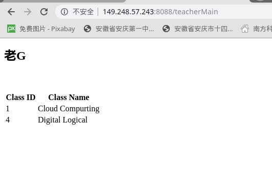