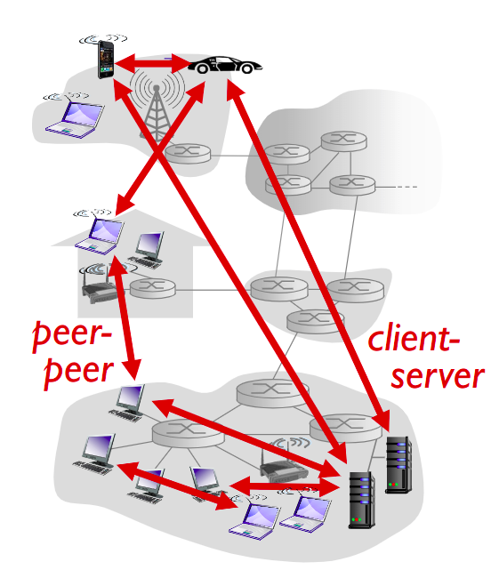
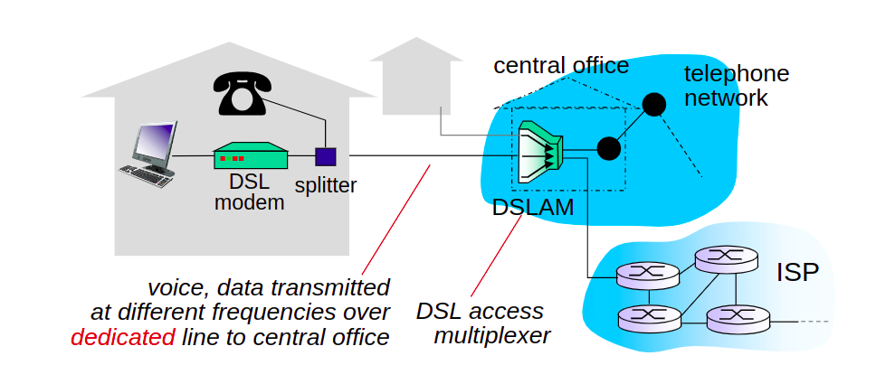
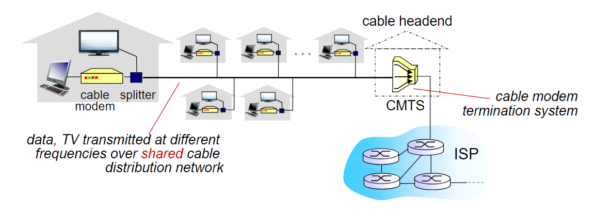
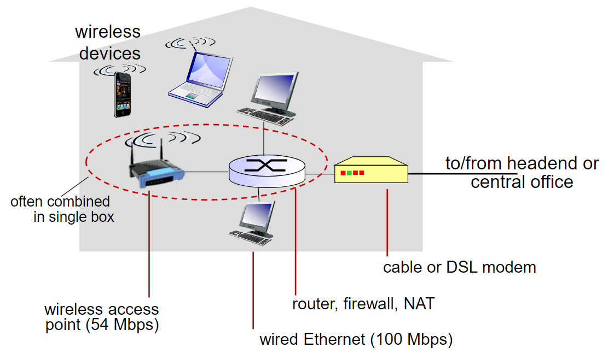
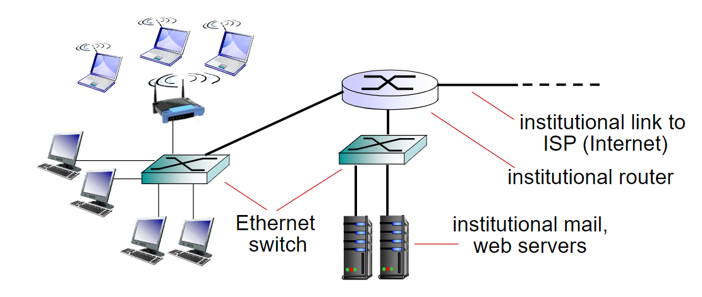
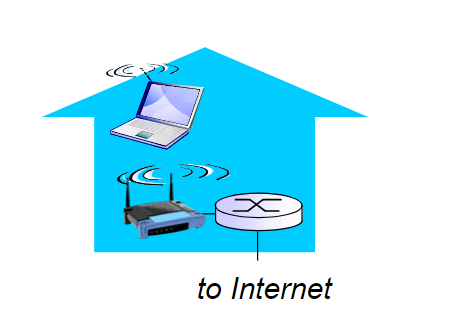
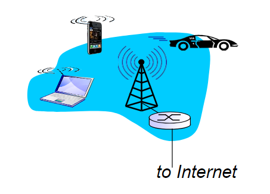
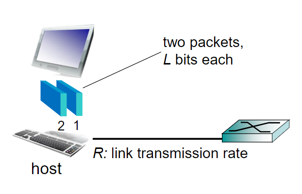
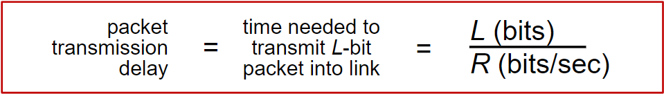

# Lecture_0

## Some Introduction

### Edge and core
*    network edge
        *    Hosts : 客户端和服务器
        *    Access network : 移动网络, 家庭网络, 工业网络
        *    Physical media : wired(有线网路), wireless communication links(无线连接)
*    network core
        *    Interconnected router 互相连通的路由器
        *    network of networks 各个网络组成的网络(教育网等各种专网, 各个局域网, 各个网络中转节点下连接的子网)

#### The network edge
*    end systems(hosts)
        *    application programs
        *    eg. Web, email
        *    at "edge of network"
*    cient/server model
        *    client host requesrs, receives service from always-on server. (客户端主持请求, 从保持开启的服务器中接受服务)
        *    eg. Web browser/server; email client/server
*    pear-pear model(对等模型,p2p)
        *    minimal(or no) use of dedicated servers
        *    eg. Skype, BitTorrent

  
#### Access networks and physical media
**How to  connect end systems to edge router?**  
*    住宅接入网
*    公共接入
*    移动接入网络
**Basic Concepts**  
*    Bandwidth(带宽) of access network. (bits per second  bps)  
*    Shared or dedicated. (公开的或是私有的)
#### Access net: Digital subscriber line(DSL)
*使用有线数字网络接入到调制解调器, 以获得网络 (使用电信运营商的电话线)*  

*    Use existing telephone line to central office DSLAM
        *    data over DSL phone line goes to Internet
        *    voice ovew DAL phone line goes to telephone net
*    <2.5 Mbps upstream transmission rate (typically < 1 Mbps)
*    <24 Mpbs downstram transmission rate (typicaly < 10 Mbps)

#### Access net: cable network  
使用专用的网口接入  
  

*    HFC: hybrid fiber coax 光纤同轴混合线缆  
        *    asymmetric(非对称)：30Mbps下行，2Mbps上行  
*    network of cable, fiber attaches homes to ISP router  
        *    homes **share access network** to cable headend  
        *    unlike **DSL**, which has dedicated access to central office  
#### Access net: home network

#### Enterprise accsee networks(Ethernet) //以太网
*    Typically used in companies , universities,etc
*    10Mbps, 100Mbps, 1Gbps, 19Gbps transmission rates
*    Today, end eystems typically connect into  Ethernet switch.

#### Wireless access network
1.    wireless Lans 
        *    Within building
        *    802.11b/g/n/ac(WIFI): 11/54/800/1733Mbps
        
2.    Wide-area wireless access
        *    provided by telco(cellular) operator, 10's km
        *    10Mbps,100Mbps, 10Gbps
        *    3G,4G,5G
        

#### Host: sends packets of data
    host表示能够同其他机器互相访问的本地计算机。一台本地机有唯一标志代码，同网络掩码一起组成IP地址，如果通过点到点协议通过ISP访问互联网，那么在连接期间将会拥有唯一的IP地址，这段时间内，你的主机就是一个host。————来自百度百科

**Host sending function**
1. 从应用中获取信息
2. 将这些信息分割成更小的块，也就是我们所说的*packets*（包）。假设一个包的长度为**L** bits
3. 将包以transmission rate(传输速度) R发送入网络
      
*   link **transmission rate**, aka link **capacity**, aka **link bandwidth**

### Physical media
*    bit(比特)：在发射/接收机间传输
*    pysical link(物理连接): 连接发射机(transmitter)与接收机(receiver)
*    guided media(导向性媒介): 信号在固体介质中传输: 如铜线,光纤,同轴线等
*    unguided media(非导向性媒介): 信号自由传输: 如无线电(radio)
*    twisted pair(双绞线): 
        *    两条绝缘(insulated)的铜线
            *     Category 5 : 100Mbps, 1Gbps Ethernet
            *     Category 6 : 10Gbps

#### Physical media: guided
*    Coaxial cable(同轴线)
        *    两根同轴的铜线
        *    双向传输(bidirectional)
        *    多路线缆(multiple channels on cable)
        *    混合光纤同轴(HFC)
*    fiber optic cable(光纤线)
        *    玻璃光纤可以携带光脉冲,一个波长就是一比特
        *    高速操作
                *    higih-speed point-to-point transmission(10's-100's Gbps transmission rate)
        *    低错误率
                *    repeaters spaced far apart (中继器间隔较远)
                *    immmune to electromagnetic noise (可以免除电子噪声)
                
#### Physical media: unguided(Radio)
*    信号由电磁波搭载
*    没有物理意义上的线缆连接
*    双向传输(bidirectional)
*    受传播环境的影响:
        *    reflection(反射)
        *    物体的阻挡
        *    接口

*    无线电传输类型:
        *    Terrestrial microwave(地面微波)
                *    up to 45Mbps channels
        *    LAN(e.g WIFI)
                *    11,45,800,1733Mbps
        *    wide-area(e.g. 3g, 4g)
                *    10,100Mbps,10Gbps
        *    satellite(卫星)
                *    Kbps to 45Mbps channel (or multiple small channels)
                *    270ms end-end delay
                *    geosynchronous versus low altitude()

