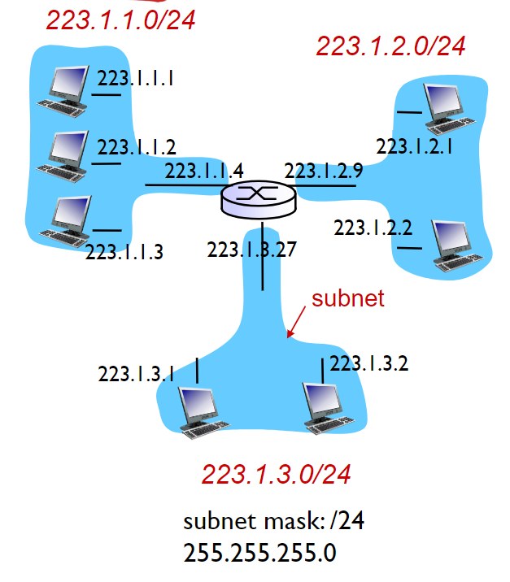
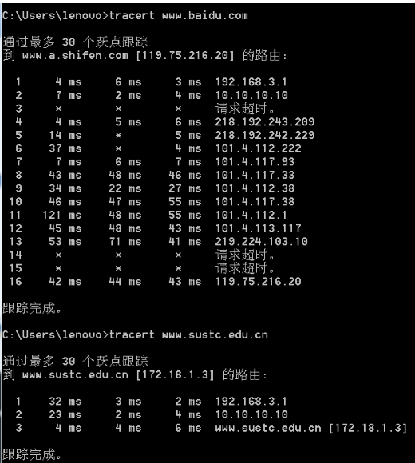
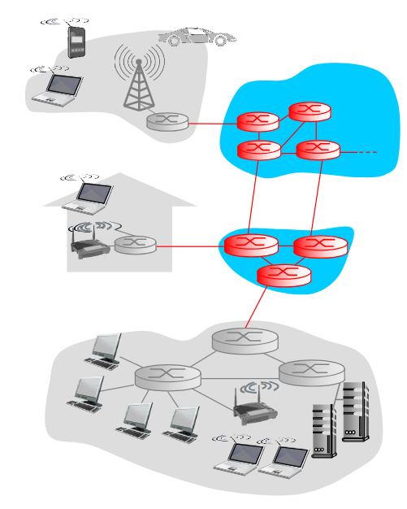
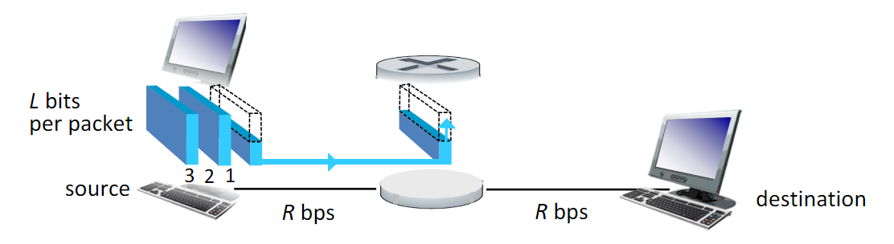
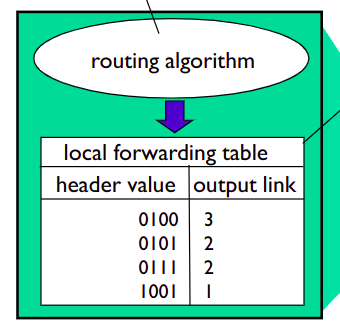
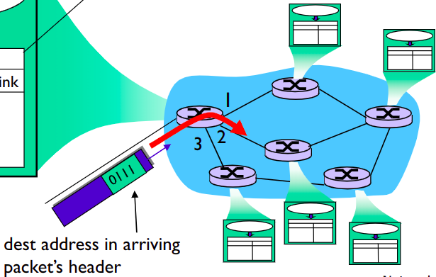

# Lecture_1
**Three Big Questuons**
*    Who am I?
        *    Host name
*    Why am I here?
        *    IP address:
               *    IPv4: 32-bits
               *    IPv6:128-bits
               *    ICANN(Internet Corporation for Assigned Names and Numbers //互联网名称与数字地址分配机构)
               *    Subnet part: high order bits
               *    host part: low order bits
        *    Subnet mask 子网掩码
                *    What's a subnet:
                        *    Devcice interfaces with same subnet part of IP address
                                //为了确定网络区域，分开主机和路由器的每个接口，从而产生了若干个分离的网络岛，接口端连接了这些独立网络的端点。这些独立的网络岛叫做子网
                        *    Can physically reach each other **without intervening router**
        *    Default gateway 默认网关  
        
*    Where an I going?  
        *    Go through muliple hops(跳板)
        *    Number of hops varies(复合)
        *    Delay for each hop varies  

*    Internal address VS extenal address
        *    www.sustc.edu.cn
        *    172.18.1.3(internal)//内网IP
        *    116.7.234.3(external)//外网IP

##    The netwoek core
*    Mesh of interconnected routers (相互联通的路由器网络)  
*    **packets-switching**(包交换):hosts将应用层的数据分割成一个个包
        *    通过从Source 到 destination的连接, 将包层层转发
        *    每个包都以满带宽传输(each packet transmitted at full link capacity)       #*?? what this mean?*  
        
        #### Packet-switching: Store and forward
        *    it takes L/R seconds to transmit(push out) L-bit packet into link at R bps
        *    **Store and forward**: entire packet must arrive at router before ot can be transmitted on next link  
             一个包只有在完全到达当前路由器之后才能被传到下一级路由器
        *    end-end delay is 2L/R(假设完全没有传播延迟)
        
        ##### Packet-switching: queueing delay(排队延迟),loss(丢包)
        *    queuing and loss:
                *    If arrival rate (in bits) to link exceeds transmission rate of link for a period of time:(如果包到达的速率超过连接的传输速率一段时间之后:)
                        *    包会排队, 等待被传输. 造成排队延迟  
                        *    如果内存满了,包会被抛出,造成丢包  
        #### Alternative core: circuit switching
        

### Two key network-core functions
*    Routing:  
        Determines source-destination route taken by packets
        //决定包从起点到终点的路由
        
*    Foward:
        Move packets from router’s input to appropriate router output
        //将包从路由器的输入移动到合适的输出
        
        

