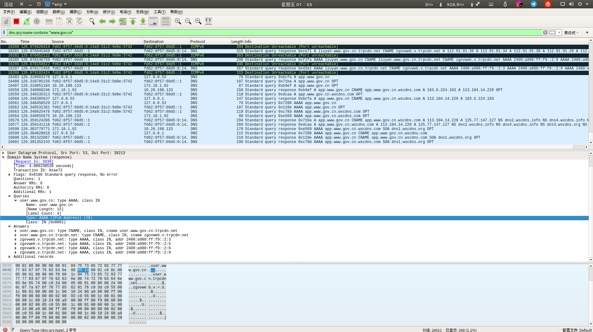
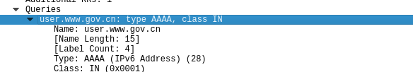
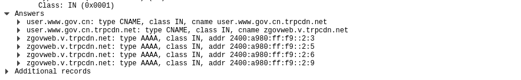

****

Lab_4.1

姓名：汪至圆 &nbsp; 学号11610634

# 实验内容
*   Capture DNS query sent from your computer
    *    Using capture filter udpport 53
    *    Using display filter (any domain filter is ok)

# 实验过程
*   Open the wireshark and set the filter
*   Find the packet we want
*   Get message from the packet

# 结果分析
##  How did you trigger the DNS query ?
*   Access the Web on the browser by domain name but not the IP Address

## Where did the query send? (IP)
*   The query is send from my computer. 
*   The IP is my IP adress relative to the DNS server. like this, my computer and the DNS server is in the inner network of SUSTech, so my IP is also my ip in the inner network of SUSTech

## What did the query said? 

*   Name user.www.gov.cn: The host name we want to access.
*   type AAAA: The connection is use IPv6 protocal 
## Does the server support recursive query?
**Yes**
We can know it by this:

## What did the response said?
*   www.gov.cn is really www.gov.cn.trpcdn.net
*   www.gov.cn.trpcdn.net is really zgovweb.v.trpcdn.net
*   zgovweb.v.trpcdn.net is on IP address 2400:a980:ff:f9::2:3
*   zgovweb.v.trpcdn.net is on IP address 2400:a980:ff:f9::2:5
*   zgovweb.v.trpcdn.net is on IP address 2400:a980:ff:f9::2:6
*   zgovweb.v.trpcdn.net is on IP address 2400:a980:ff:f9::2:9

# 小结与感悟
通过对dns信息的抓取与分析, 我们可以得知一个网站的服务器IP地址, 以及每一级跳转路由的IP地址
