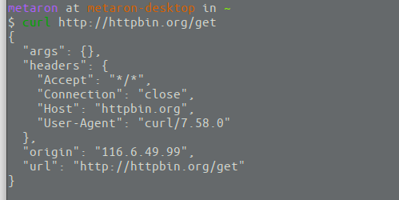
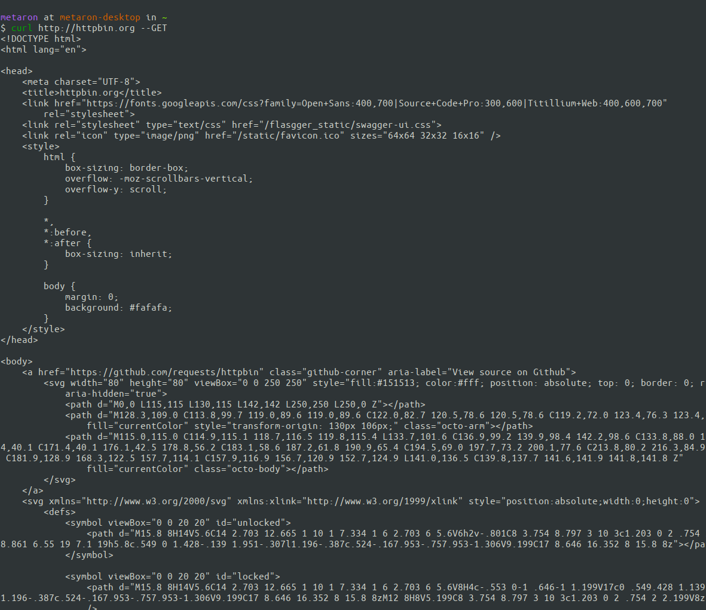
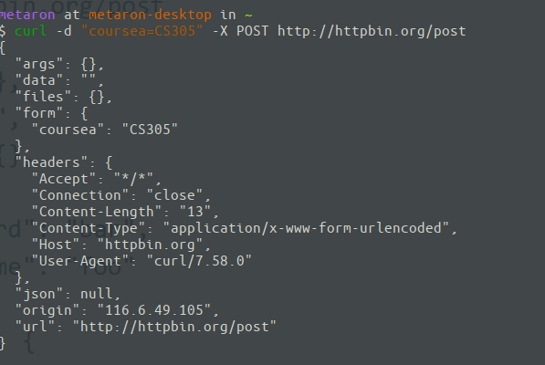
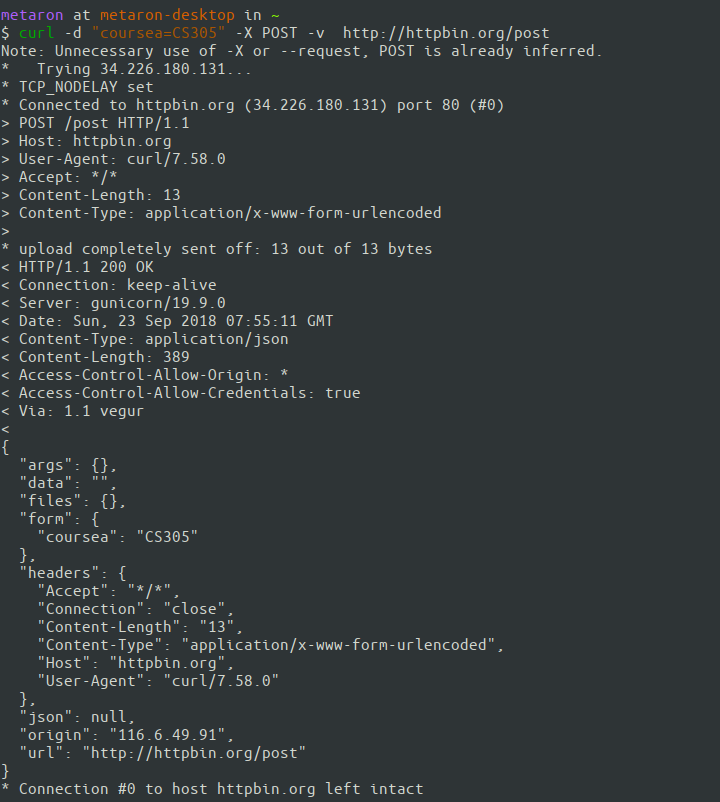
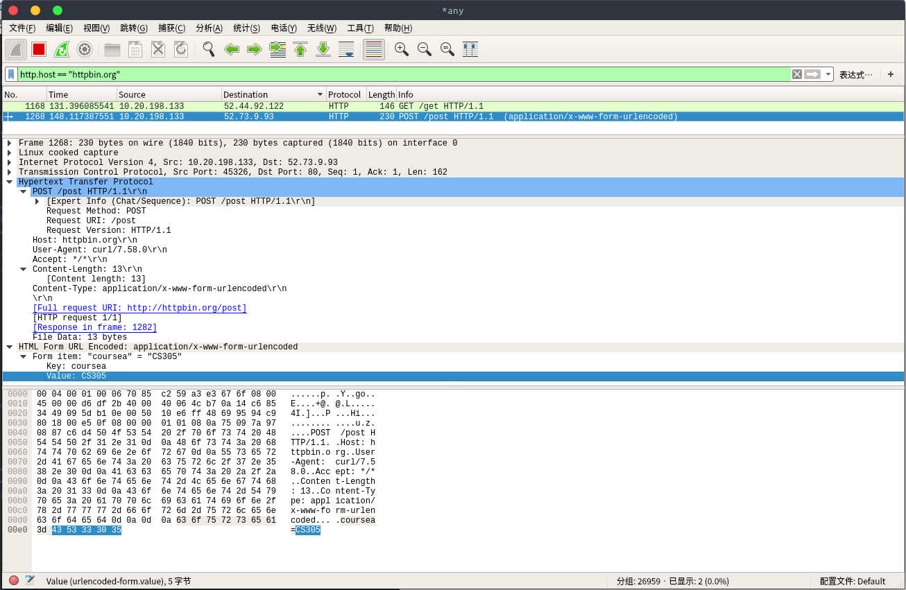
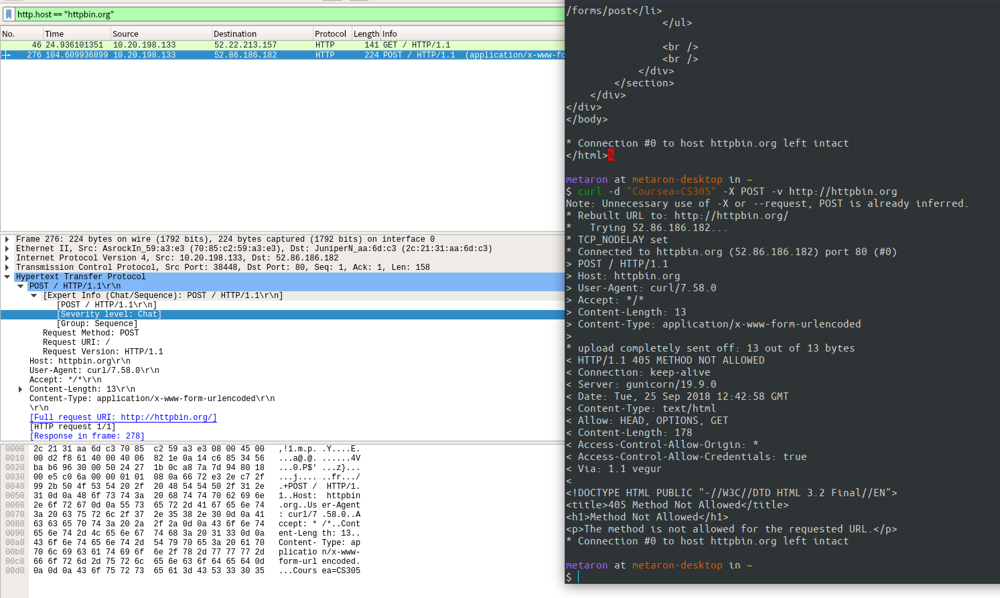

# Lab_3.1

姓名:**汪至圆** 学号:**11610634**

## 实验内容
*   Using cURL make GET request to http://httpbin.org/get
 *    Using  cURL make POST request to http://httpbin.org/post
        *    Using curl -v to inspect the interaction–Using wireshark to capture the
        *   packet cURL sent

## 实验过程:

*    **Get**:

*    **Post**:

        *    Using curl -v to inspect the interaction:
        
        *    Using wiresharkto capture the packet cURL sent:
        

## 结果分析:
### What did you get via cURL?:
*    目标网址的header信息,包括http版本, mimetype, 编码格式, Connection类型, 还有浏览器当前的UA类型
*    目标页面的HTML代码
*    POST数据之后目标网站中存在的键值对等信息

### What are the meaning of fields in your request and response headers?
*    Accept: 能被浏览器相应的文件的类型,这里表示所有的都可以被允许
*    Connection: 链接类型,这里为close
*    Content-length: 内容长度,response/request的内容的长度
*    Host: 目标主机的名称
*    Content-type: 内容的mimetype,内容格式与指定打开方式
*    User-Agent: 用户代理, 用户使用的浏览器的类型

### Did wiresharkcapture correspond to the cURL request?
**Yes**

##  小结及感悟
本次实验主要是使用curl从目标网址GET数据和POST数据. 同时使用WireShark进行抓包并分析.   
本次实验能让我们掌握curl的初步使用还有WireShark抓包工具的初步使用数据分析.