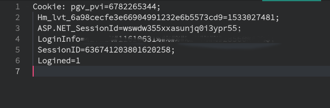
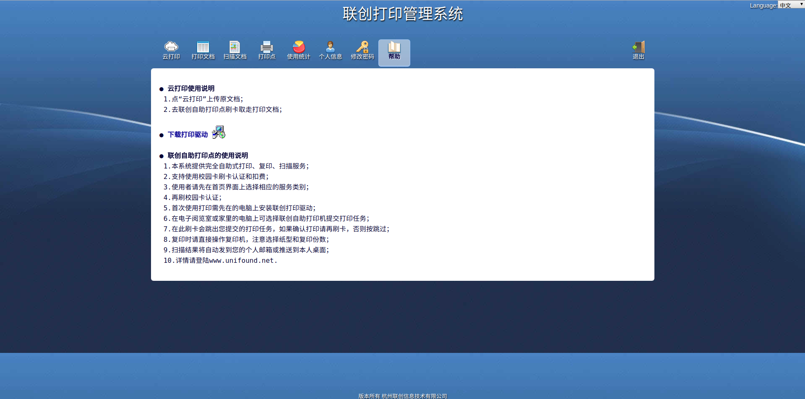

****

<center><font face="微软雅黑" size="6">Lab_4.1</font></center>
<center><p>姓名：汪至圆 &nbsp; 学号11610634</p></center>

# 实验内容
*    Try to capture session cookie of pms.sustc.edu.cn (yours or your classmates’)
*    Manipulate your cookie of pms.sustc.edu.cn to hijack this session. (Chrome Extension:edit this cookie)
*    Or you can replay the HTTP request using curl. (https://github.com/jullrich/pcap2curl)

# 实验过程:

## Write the Shell Script to change the Wirless Adapter to Monitor mode:
``` sh
sudo iw phy phy0 interface add mon0 type monitor
sudo iw dev wlp30s0 del
sudo ip link set mon0 up
sudo iw dev mon0 set freq 2437
sudo ifconfig mon0 promisc
sudo ifconfig mon0 down
sudo ifconfig mon0 up
sudo ifconfig mon0 up
```
## Change its permission and run it.
**After thr Option above We can get this:**


## Open WireShark Set tcp port http and then open the mon0

## Find the poocket we need and choice it
**Find the cookie and copy it as text**  
**Paste to the Vscode**


## Open the Chrome
Connect to the pms.sustc.edu.cn


*    Delete all the Cookie

*    Login my self account


*    Output the cookies as json and exit my account


*    Change the value by the pocket we get.


*    Input the cookies by json


*    refresh The page

*We can find that we can upload the Document*


## Request  By the curl:
*    Copy the cookie as String and use curl -b "cookies" pms.sustc.edu.cn to get


#    结果分析
##    How did you capture the cookie? What’sthecontentofthecookie?

*    Get the packet by the wireshark and filter them buy " http.host == "pms.sustc.edu.cn" || http.host == "172.18.1.141"
*    Then we can find all the packet that comunicate with pms.sustc.edu.cn
*    Find a POST request and get its infomation
*    Its cookies is our goal.
        
*    By this Cookies, we can know:
        *    The Student of him
        *    The SeesionID
        *    The login status

## How did you set your cookie into target values?Show the edit page
*    Using editthiscookie, a extention of **Chrome**.
*    First get the cookies of this page by editthiscookie on json
*    Find the value we need to set, like sessionid logininfo and so on.
*    Import the cookies on json by editthiscookie


*    Delete all the Cookie

*    Login my self account


*    Output the cookies as json and exit my account


*    Change the value by the pocket we get.


*    Input the cookies by json


*    refresh The page


## Did you success hijack the session? Describe how did you do it
**Yes**

I get my roommate's cookies by the wireless Adapter which is on Monitor mode and copy it to my editor.(With the consent of my roommate)
And then open  the pms pages and replace the cookies and refresh the page.
 Now, I'm login as my roommate's Identify.

#    小结与感悟
在非加密的网络传输环境下, cookies在带来便捷的同时, 也会带来十分大的安全隐患.  
为了数据和个人信息的安全, 应当尽量避免使用非加密的公共网络, 同时及时清除cookies信息


