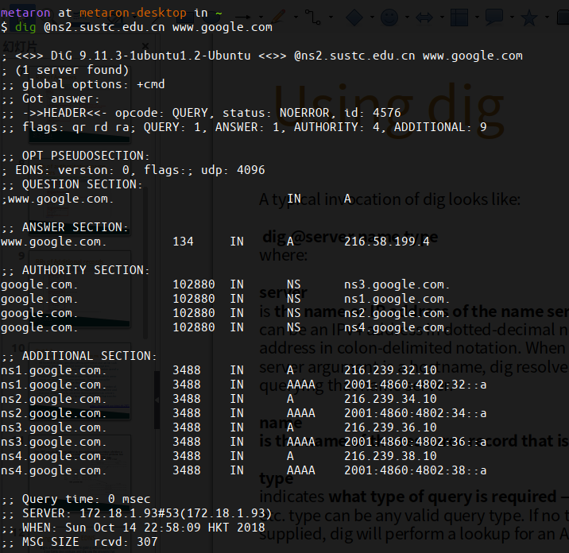
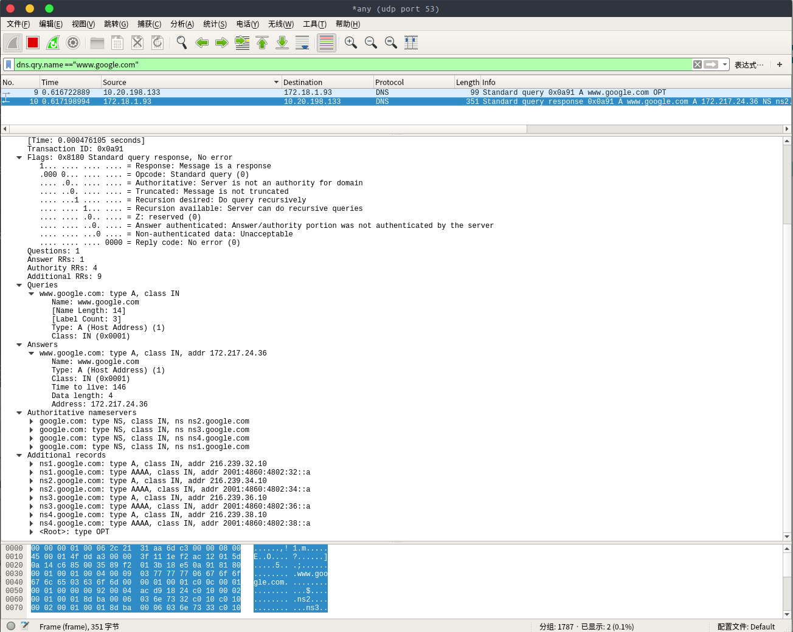
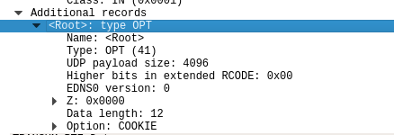
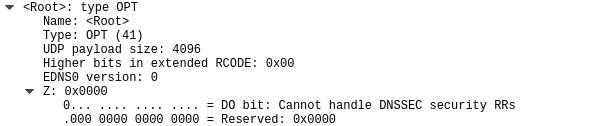
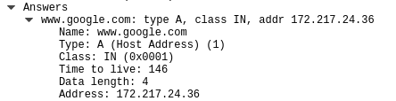
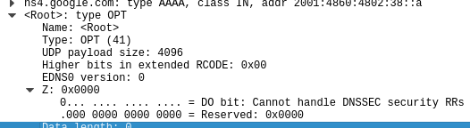

****

Lab5.1

姓名：汪至圆 &nbsp; 学号11610634

#   一. 实验内容:

*   make an DNS query which will invoke the EDNS0
    *   Screenshot on this command and its output
*   capture the packages using Wireshark
    *   what is the content of this query message
        *   Find the  name, type and class of this query
        *   How can you tell this DNS query is based on EDNS0
        *   From this query massage , can it handle DNSSEC security RRs or not
    *   what is the content of this response message
        *   Is there any answers, what’s the ttl of each answer
        *   Is there any authority RRs, what’s the type of each RR
        *   Is there any special additional RRs with OPT type, what does its ‘Do bit’ say: Does it accept DNSSEC security RRs or not

#   二. 实验步骤:
##  make an DNS query which will invoke the EDNS0
*   Open the terminal and execute dig

##  capture the packages using wireshark
*   Open the wireshark and get the packages

#   三. 实验结果:
##  make an DNS query which invoke EDNS0

##  capture the packages using wireshark  

#   四. 实验分析:
##  make an DNS query which invoke EDNS0
*   screenshot on this command and its output
The screenshot is in the *Experimental result*

##  capture the packages using Wireshark
*   what is the content of this query message
    *   a. Find the  name, type and class of this query
        1. name: www.google.com
        2. Type: A
        3. Class: IN
    *   b. How can you tell this DNS query is based on EDNS0
        * Because I can find OPT in the Additional records.  
        
    *   c.  From this query massage , can it handle DNSSEC security RRs or not
        * It cannot handle DNSSEC security RRs  
        
*    what is the content of this response message:
     *   a. Is there any answers, what’s the ttl of each answer:
           *  There is an answers and its ttl is 146  
           
      *    b. Is there any authority RRs, what’s the type of each RR:
           *    There are 4 authority RRs, and all of there types of RR are **NS**  
           
      *    Is there any special additional RRs with OPT type, what does its ‘Do bit’ say: Does it accept DNSSEC security RRs or not
           *    There is one special additional RRs with OPT type  
           
           *    Its 'Do bit' say: **Cannot handle DNSSEC security RRs.**