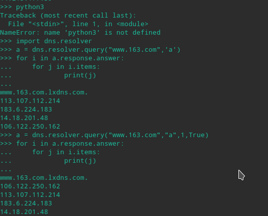
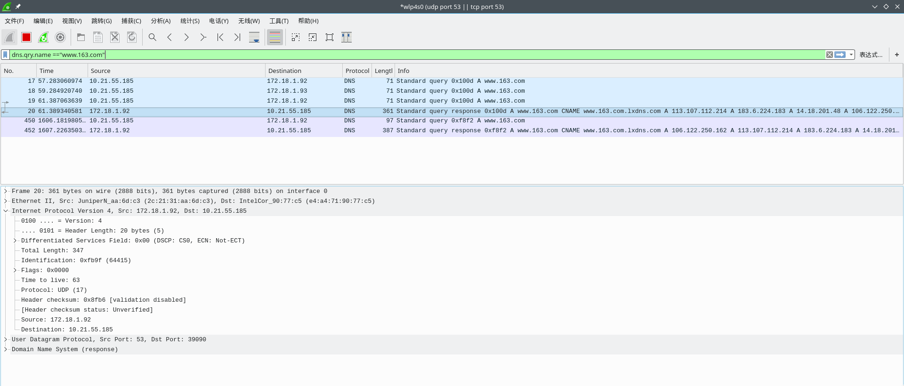
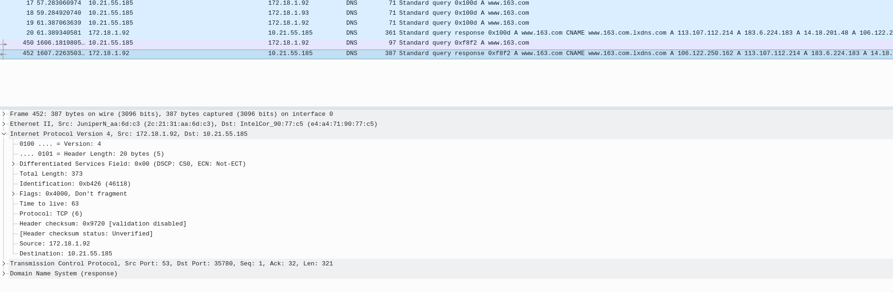
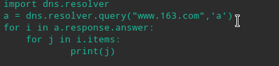
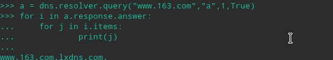
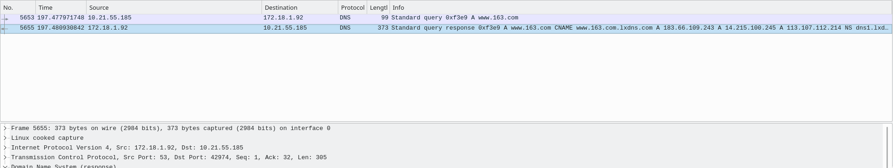
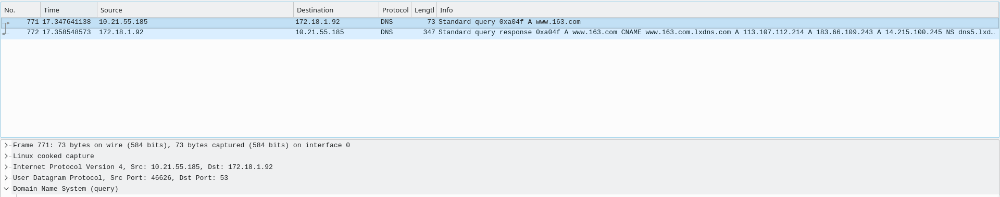
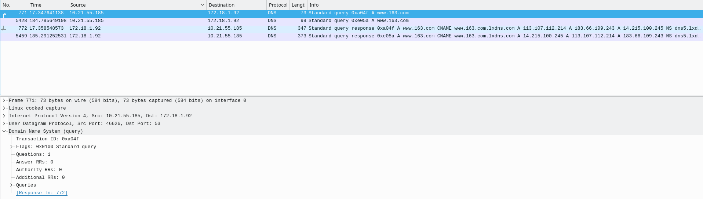
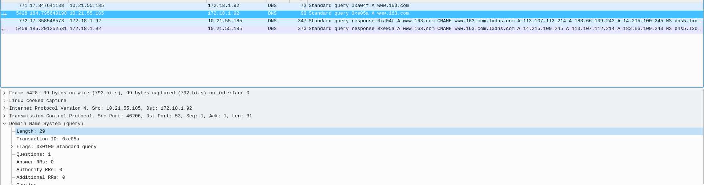
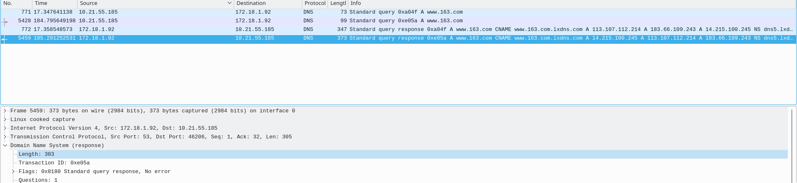

****

Lab5.2

姓名：汪至圆 &nbsp; 学号11610634

#   一. 实验内容:
*   Make the query by using  query method of“dnsresolver”(a python package)
    *   To query the type A value of www.163.com based on TCP and UDP stream respectively
*   capture the related TCP stream and UDP stream using Wireshark
    *   Screenshot on this two commands . what’s the default transport lay protocol while invoke DNS query
    *   Screenshot on the TCP stream of query by TCP. how many TCP packets are captured in this stream, Which port is used?
    *   Screenshot on the UDP stream of query by UDP. how many UDP packets are captured in this stream, Which port is used?
    *   Is there any difference on DNS query and response message while using TCP and UDP respectively

#   二. 实验步骤
*   install the dnspython for the python3
*   Open the wireshark
*   import the dns.resolver and use it to query
*   Use wireshark to get the packet and analyze it.

#   三. 实验结果：
##  1.  Make the query by using  query method of“dnsresolver”(a python package)
### (1) To query the type A value of www.163.com based on TCP and UDP stream respectively

##  2.  capture the related TCP stream and UDP stream using Wireshark

#   四. 实验分析
##  1.  Make the query by using  query method of“dnsresolver”(a python package)
### (1) To query the type A value of www.163.com based on TCP and UDP stream respectively
*   The result we get from the query is on above
*   When do query base on UDP stream, we use dns.resolver.query("www.163.com","a"), it will query on UDP stream.
*   When do query base in TCP stream, we use dns.resolver.query("www.163.com","a",1,"True"), it will query on TCP stream.

##  2.  capture the related TCP stream and UDP stream using Wireshark
### (1) Screenshot on this two commands . what’s the default transport lay protocol while invoke DNS query
*   **The default transport lay protocol while invoke DNS query is UDP**
*   UDP:
    *   
*   TCP:
    *   
*   Differents: The **initial value** of parameter 'TCP' of **dns.resolver.query()** is **False**. 
    *   So when we do the query base on the UDP, when don't need to set this value. 
    *   When we do the query base on the TCP, we need to set the parameter 'TCP' equal to **True**

### (2)   Screenshot on the TCP stream of query by TCP. how many TCP packets are captured in this stream, Which port is used?

*    Have captured **2** TCP packets
*    The port the DNS Server used is **53**.

### (3)   Screenshot on the UDP stream of query by UDP. how many UDP packets are captured in this stream, Which port is used?

*    Have captured **2** UDP packets
*    The port the DNS Server used is **53**.

### (4)   Is there any difference on DNS query and response message while using TCP and UDP respectively
*    Query:
     *    UDP:
     *    TCP:
*    Response:
     *    UDP:
     *    TCP:

*   So, when we use TCP to do DNS query and response, we will get one more information of this packets' length then the UDP.