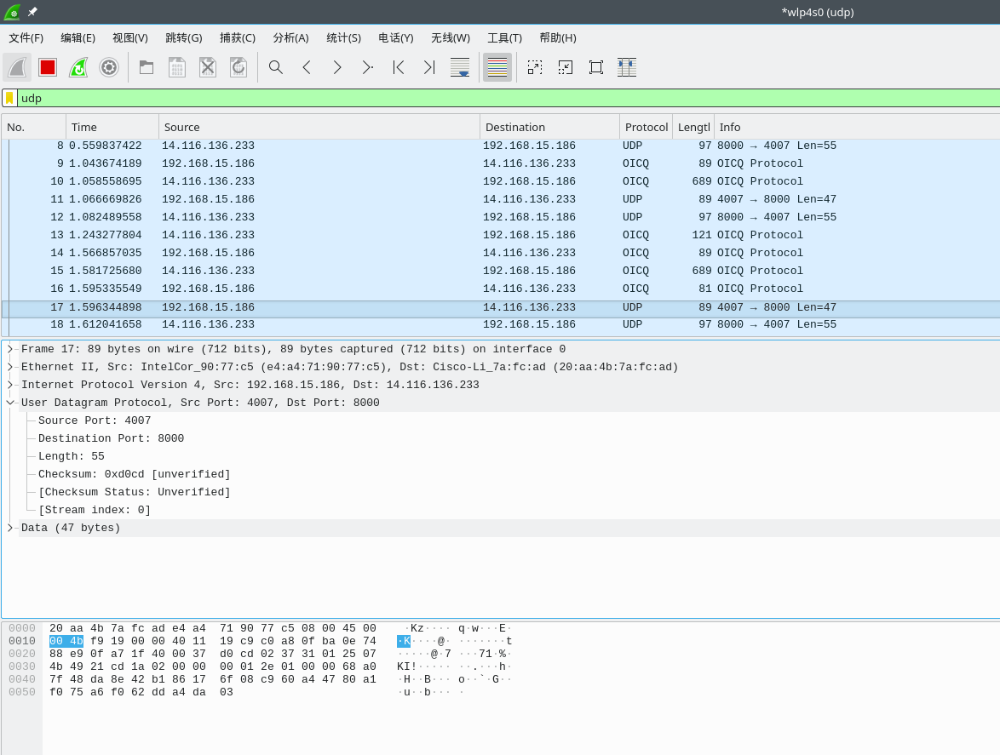
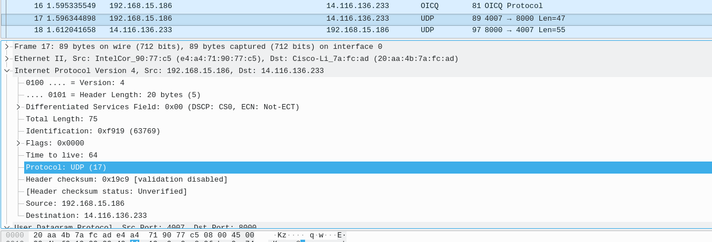

****

Lab6.1

姓名：汪至圆 &nbsp; 学号11610634

#   一. 实验内容:
##  Select one UDP packet from your trace. 
*   1. From this packet, determine how many fields there are in the UDP header. Name these fields.
*   2. consulting the displayed information in Wireshark’s packet content field for this packet, determine the length (in bytes) of each of the UDP header fields.
*   3. The value in the Length field is the length of what? Verify your claim with your captured UDP packet.
*   4. What is the maximum number of bytes that can be included in a UDP payload? (Hint: the answer to this question can be determined by your answer to 2. above)
*   5. What is the largest possible source port number? (Hint: see the hint in 4.)
*   6. What is the protocol number for UDP?( Give your answer in both hexadecimal and decimal notation. )
##  Examine a pair of UDP packets in which your host sends the first UDP packet and the second UDP packet is a reply to this first UDP packet.
*   1. Describe the relationship between the port numbers in the two packets. 

#   二. 实验步骤
*   Get a UDP packet from WireShark
*   Analysis it.

#   三. 实验结果
*   The Screenshot of the packet:
    *   
    *   
#   四. 实验分析
##  Select one UDP packet from your trace. 
*   1. There are 4 fields in the UDP header:
    *   Source port
    *   Destiantion Port
    *   Length
    *   Checksum

*   2. Each fields' length is **2 Bytes**

*   3. It's the sum of the number of bytes in header and the number of bytes in the payload:
    *   8 bytes in the header
    *   47 bytes in the payload( In this Screenshot)

*   4. For that the length of *Length field* is 2 bytes. So the maximum of the Length is $2^{16}-1=65535$. So the maximum number of the bytes in the payload is **$65535-8=65527$**

*   5. For the length of Source prot is 2 bytes. So teh maximum of the source port is **$2^{16}-1=65535$**

*   6. The IP protocol is **17**. In bytes should be **b'\x11'**

##  Examine a pair of UDP packets in which your host sends the first UDP packet and the second UDP packet is a reply to this first UDP packet.
*   1. For these two packets:
    *   The Source port of the first packet is the Destination port of the second packet.
    *   The Destination port of the first packet is the source port of the second packet.

