****

Lab6.2

姓名：汪至圆 &nbsp; 学号11610634

#   一. 实验内容:
*   3. What is the IP address and TCP port number used by your client computer(source) to transfer the file to gaia.cs.umass.edu?
*   4. What is the sequence number of the TCP SYN segment that is used to initiate the TCP connection between the client computer and gaia.cs.umass.edu? What is it in the segment that identifies the segment as a SYN segment?
*   5. What is the sequence number of the SYNACK segment sent by gaia.cs.umass.edu to the client computer in reply to the SYN? What is the value of the Acknowledgement field in the SYNACK segment? How did gaia.cs.umass.edu determine that value? What is it in the segment that identifies the segment as a SYNACK segment?
*   6. What is the sequence number of the TCP segment containing the HTTP POST command? Note that in order to find the POST command, you’ll need to dig into the packet content field at the bottom of the Wireshark window, looking for a segment with a “POST” within its DATA field.
*   7. Consider the TCP segment containing the HTTP POST as the first segment in the TCP connection. What are the sequence numbers of the first six segments in the TCP connection (including the segment containing the HTTP POST)? At what time was each segment sent? When was the ACK for each segment eceived? Given the difference between when each TCP segment was sent, and when its acknowledgement was received, what is the RTT value for each of the six segments? What is the EstimatedRTT value (see Section 3.5.3, page 242 in text) after the receipt of each ACK? Assume that the value of the EstimatedRTT is equal to the measured RTT for the first segment, and then is computed using the EstimatedRTT equation on page 242 for all subsequent segments. Note: Wireshark has a nice feature that allows you to plot the RTT for each of the TCP segments sent. Select a TCP segment in the “listing of captured packets” window that is being sent from the client to the gaia.cs.umass.edu server. Then select: Statistics->TCP Stream Graph->Round Trip Time  Graph.
*   8. What is the length of each of the first six TCP segments?
*   9. What is the minimum amount of available buffer space advertised at the received for the entire trace? Does the lack of receiver buffer space ever throttle the sender?
*   10. Are there any retransmitted segments in the trace file? What did you check for (in the trace) in order to answer this question?

#   二. 实验过程:
*   Get the screenshot of the packet(In this Lab, use the picture from the zip)
*   Analysis it.

#   三. 实验结果:
*   Look at the forth part.

#   四. 实验分析:
*   3.  For the client:
    *   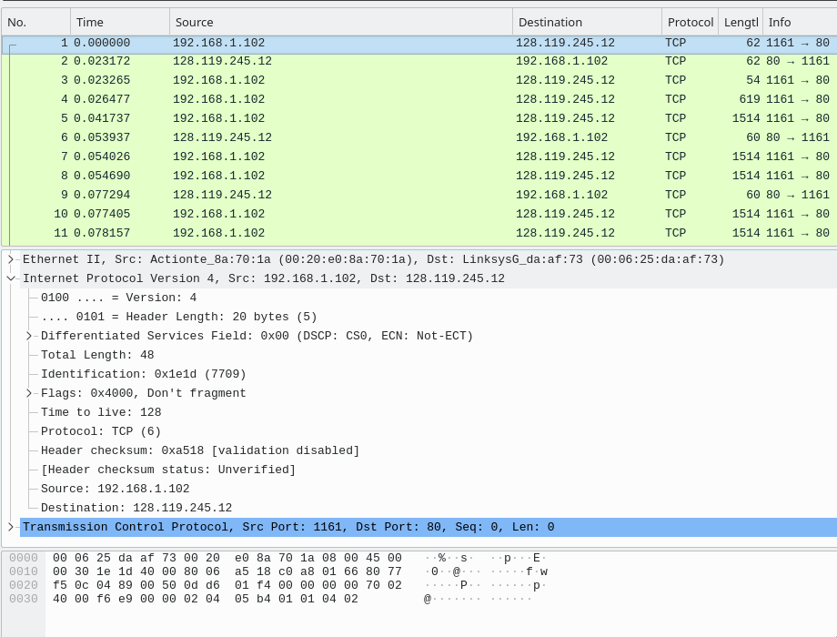
    *   The IP address is 192.168.1.102
    *   The Port is 1161

*   4.  For the TCP SYN segment:
    *   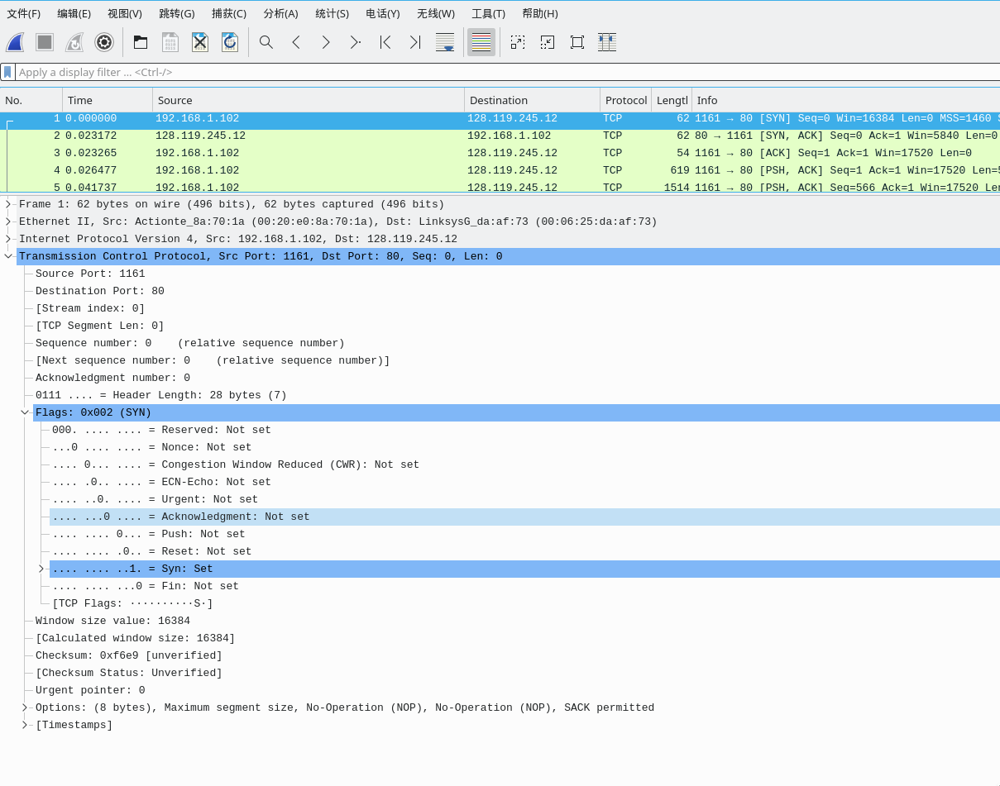
    *   The Sequence number of the TCP SYN segmet is **0** .
    *   The SYN bit is 1 and the Acknowledge bit is not set.

*   5.  For the SYNACK segment:
    *   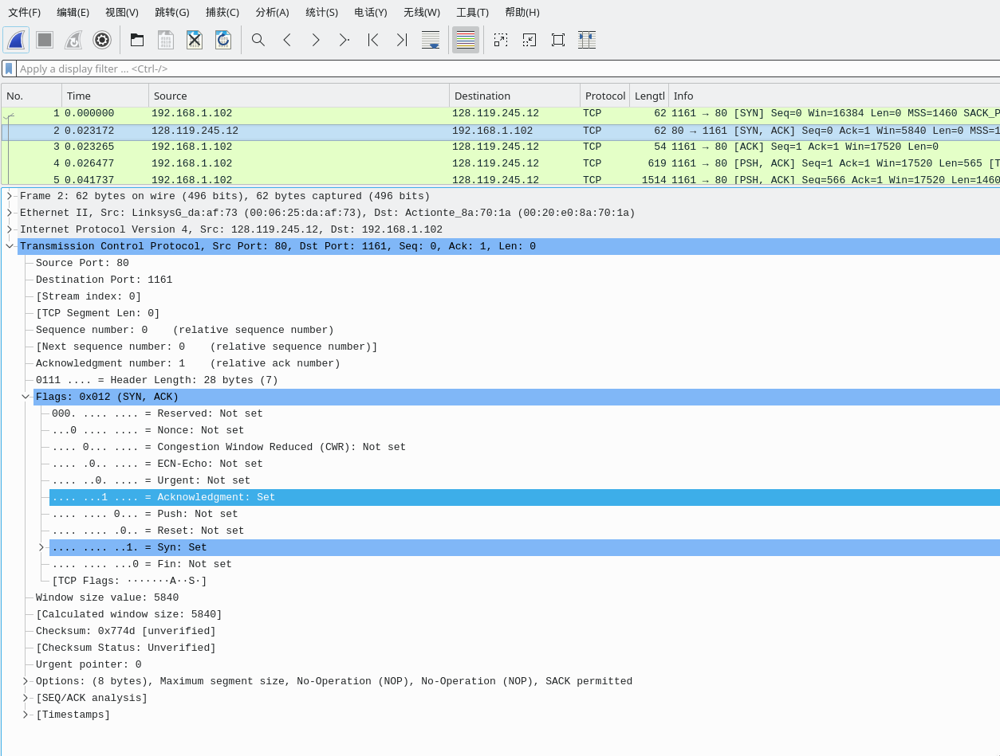
    *   The sequence number of the SYNACK segment that reply to the SYN is **0**.
    *   The value of the acknowledge field is **1** .
    *   *gaia.cs.umass.edu* determine the value is by add 1 to the sequence number that sent by the Client.
    *   The Syn bit is 1 and the Acknowledge bit is also 1.

*   6.  For the TCP segment containing the HTTP  POST command:
    *   The sequence number is 1.(This is the forth segment)
    *   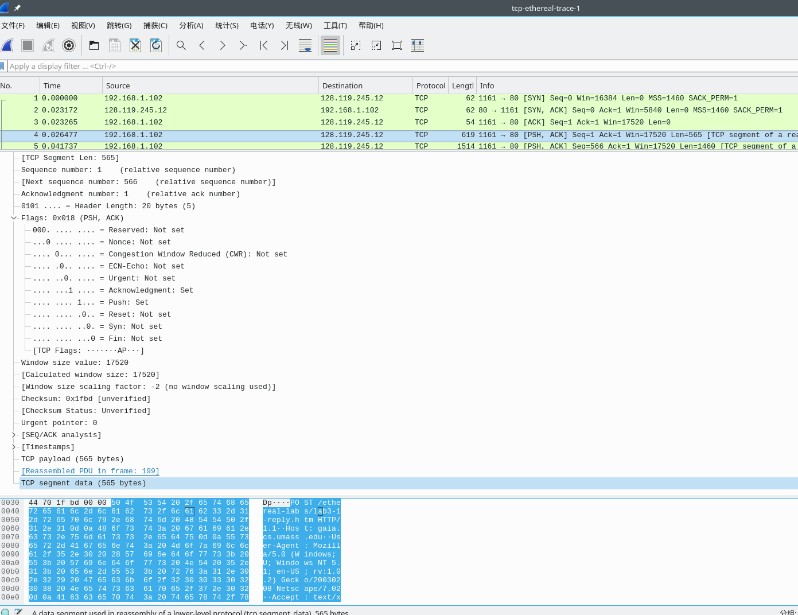

*   7.    For this question:
    *   
        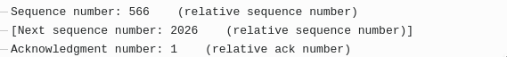
        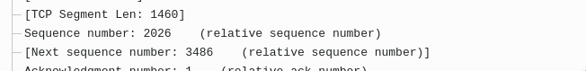
        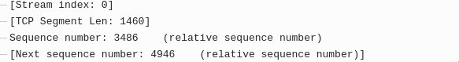
        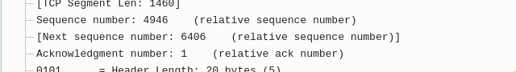
        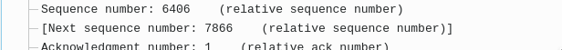
        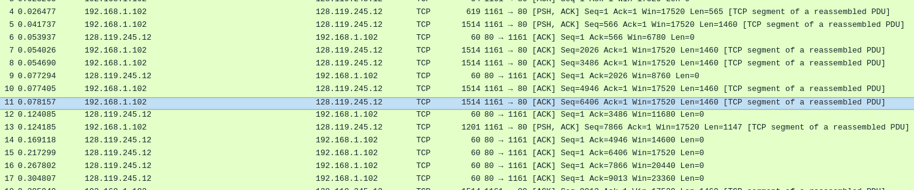
    *   The Sequence numbers are:
        *   1
        *   566
        *   2026
        *   3486
        *   4946
        *   6406
    *   For the RTT:
        *   $T_1 = 0.053937 - 0.026477 = 0.02746$
        *   $T_2=0.077294-0.041737=0.035557$
        *   $T_3=0.124085-0.054026=0.070059$
        *   $T_4=0.169118-0.054690=0.11443$
        *   $T_5=0.217299-0.077405=0.13989$
        *   $T_6=0.267802-0.078157=0.18964$
    *   For the EstimatedRTT
        *   In the book, The fomula use $\alpha=0.125$:
        *   $EstimaRTT = T_1 = 0.02746$
        *   $EstimaRTT = 0.875*0.02746+0.125*0.035557= 0.028472125$
        *   $EstimaRTT=0.875*0.028472125+0.125*0.070059=0.033670484$
        *   $EstimaRTT=0.875*0.33670484+0.125*0.11443=0.043765424$
        *   $EstimaRTT=0.875*0.043765424+0.125*0.13989=0.055780996$
        *   $EstimaRTT=0.875*0.055780996+0.125*0.18964=0.072513371$
*   8.  For these six segments:
    *   
    *   The first one is 565byts.
    *   The other fives is $2026-566=3486-2026=4946-3486=6406-4946 = 1460Bytes$

*   9.  For the buffer:
    *   
    *   The minimum amount of available buffer space is 5840 Bytes
    *   The sender won't be throttled by the lack of receiver buffer.

*   10. For the Time-sequence-Graphs of the packets.
    *   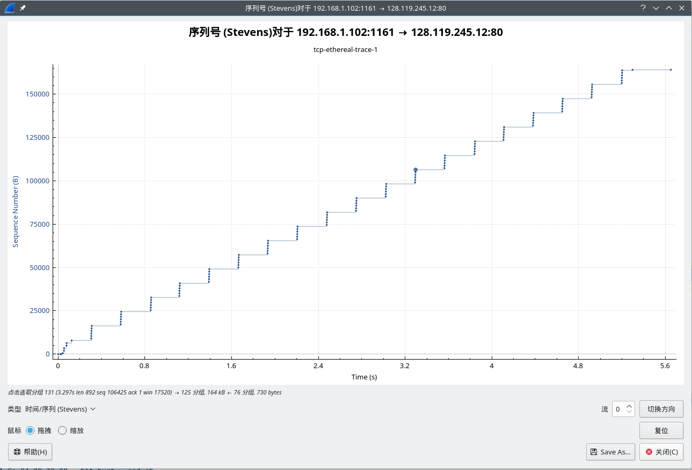
    *   There are n retransmission
    *   I check it by the Time-sequence-Graphs of the TCP Stream.
   