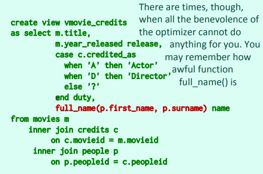
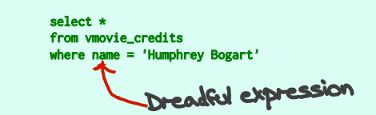
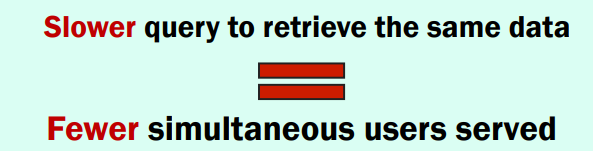
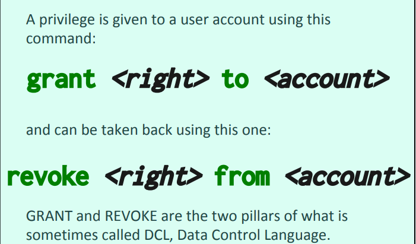
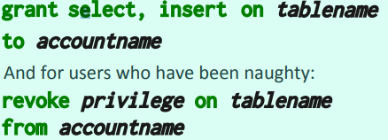
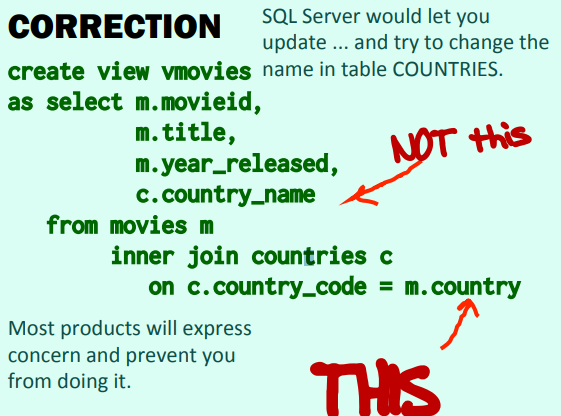
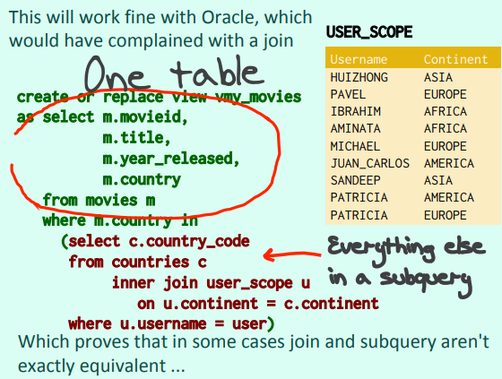
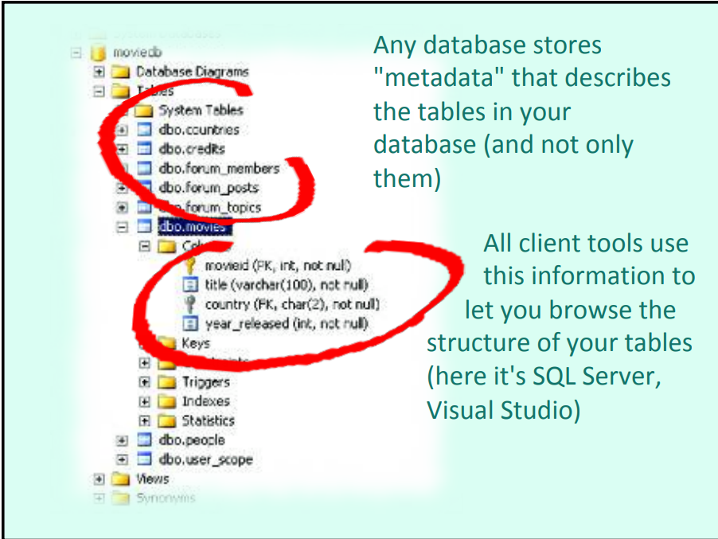
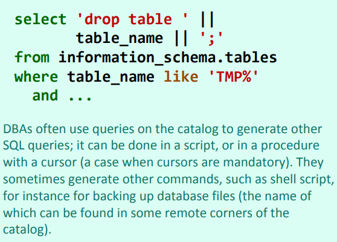

# DataBase_View

*A record orelation operation*

### Create View
```sql
Create view Viewname(col1,col2,col3)
    as
    select ...
```

视图实际上可以看成是将一个select的结果存了下来，但这个保存的东西会随着基表的变化而变化

`A view can be as a complicated query as you want, and will usually return sometion that isn't as normalized as your tables, but easier to understand`


**Remember tht tables are relational variables, and that the rows they contain are noting more athan there "value"**. In the same way that you get a different result  from a function when you change values of variables that you pass to do it,

We can query from a view exactly just like query from a table.

### Using the View
Views are just the relational equivalent of functions:  
* Return a relation but not just a value.

For the design issues, we know, modeling database is basically distrbuting data between normalized table. That means, we need to model the database according the data to let the databse more effective and save the performance and storage as we can. But there are often ways of organizing data that are more suitable for a given application. In some respect, **views** provide a way of creating an "**alternate model**"  
*也就是说，数据库设计过程中，需要考虑的是数据的特性，如何合理使用约束来设计出合理的，占用尽可能少的数据库，但是在对给定的功能进行sql实现的时候，使用原数据库query起来可能并没有那么方便，这就需要使用view来建立起一个最适合当前的功能的替代模型*

### Permanent Objects/Structure
**The views are permanent objects  in the database, what means that even you ctreate the view by the select, the coplum add after the create the view won't apear in the view**  
For ``` sql create view new as select * from movies ```  
We can see that its a class
```java
public class new{
    int col1;
    String col2;
    String col3;
}
```
If the movie add a column col4 after create the view, there want have col4 in the view

### Use
* Views are much used for simplifying queris. 
**The View looks like a table  
Also tastes(*use* ) like a table**  
For Example:  
    * We create a view to storagr the full_name of the people.  
  
    * And then can query very quickly


* Views will hide the complexity**For that we can look the view as a sub_select**
    The problem with the views is that as long as you haven't seen how they have been defined, you have no idea how complex they may be. They may be fairly innocuous, or they may be queries of death(They often be).

* Scalability
    **The data base should have the ability to deliver response times that remain acceptable when the number of users, data volumes, or both, sharply increase**(*Like 11/11 and Black Friday*)
    For this problem, the computing power is always a limited resource.
    * Slowly query will let the simultaneous users served fewer.
      
    高并发问题需要解决的是进行一次query的执行速度  
    **But**: If querying the view takes 4 times as long as querying the table, you'll just only be able to serve 25% of users.
    **So , with complex Views, more requests will be queued and will wait**

* Three areas where views are very useful
    * Reports
    * User Interface
    * **Security**  
        * How is Security managed?
            * A database account you connected means a set of privileges(*权限*).  
            A privileges is given to a user account to let them operation the tables.   
              
            And for the privileges:
            1. 系统管理员给予其他用户权限去发布数据定义语言命令，以及改变数据库结构。拥有这个权限的用户很少。      
                * 拥有这些权限的用户可以在Schema中创建Objects(*Table,View , procrdure*), 一个application经常需要调用一系列Objects.
            2. 另一类权限是关于table的， 这类权限一般是给定到特定的table, 给予delete, insert, update, select from table 以及 execute produre的权限。
              
            * **So how can views help with security?**
                We can just the grant select on the view but not a table to the user. Then the user can just see the data we want they see.
                
### Why not changing data through view?
If view are in theory like tables, why not using them for controlling not only what you see, but also what you change?
**Lots of things can go wrong**  
* View的设计目的就是多用户查询是可以更加友好，这样会失去一些table原始信息，而提取出这个view所需要的信息  
* 这就使得在update过程当中可能会找不到匹配的数据，但有些时候也可以工作的很好



#### So what if we want  to use view to update the table?  

There is a tye of trigger called an **Instead of trigger**.  
It can be created on a view and lets you call a procedure "instead of" performing the triggering event.   
e.g.:  
```sql
create or replace trigger view_insert_tigger
  instead of insert on v_emp20  
  for each row
declare
    v_empCount       NUMBER;
    v_deptCount      NUMBER;
begin
    --判断要增加的员工是否存在
    SELECT COUNT(empno) INTO v_empCount FROM emp WHERE empno=:NEW.empno;
    
    --判断要部门是否存在
    SELECT COUNT(deptno) INTO v_deptCount FROM dept WHERE deptno=:new.deptno;
  --如果员工不存在
  IF v_empCount=0 THEN
      INSERT INTO emp(empno,ename,job,sal,deptno)
      VALUES(:new.empno,:new.ename,:new.job,:new.sal,:new.deptno);
    END IF;
    --如果部门不存在
    IF v_deptCount=0 THEN
      INSERT INTO dept(deptno,dname,loc)VALUES(:new.deptno,:new.dname,:new.loc);
    END IF;
end view_insert_tigger;
--添加数据
INSERT INTO v_emp20(empno,ename,job,sal,deptno,dname,loc)
VALUES(7777,'张三丰','CLERK',800,77,'活动部','深圳');
```
instead of 类型的 trigger 每一个table或者view都只能有一个， 而after或before的trigger可以有多个


#### Another option than views: Function returning a table
* Advantage: For the function return a table, it allow you to inject a parameter deep inside a query. And view can just aplpy conditions to the data it returns.
* Disadvantage: These option is more than like a (useful dirty trick), some database don't support it or support it in different ways. Dangerous if you migrate to another DBMS.

### Application
#### A very good example of application of the view is Catalog of the database
**One catalog per database**

Whenever you are issuing DDL(DataBase definition languages) commands, you are actually modifying system tables. They must Never be directly changed.  
Read access to these tables is provided through system views.  
In this view you can only see what you are allowesd to see.only administrators can see anything.  

* Get the information of the datatbase:



