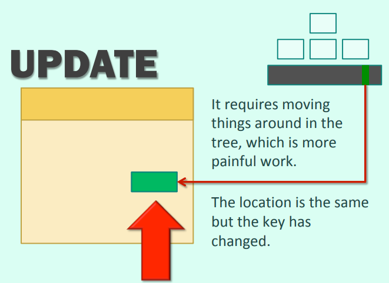
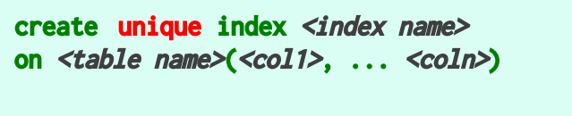
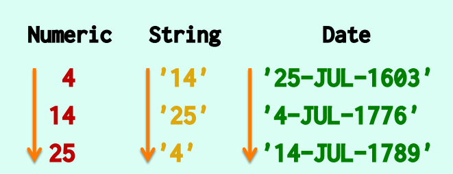
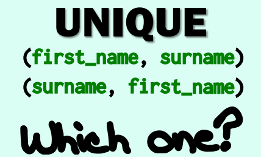
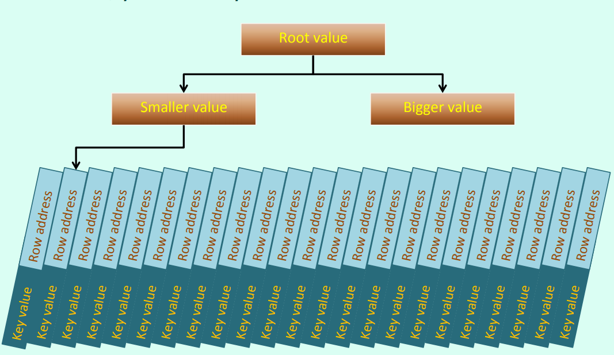
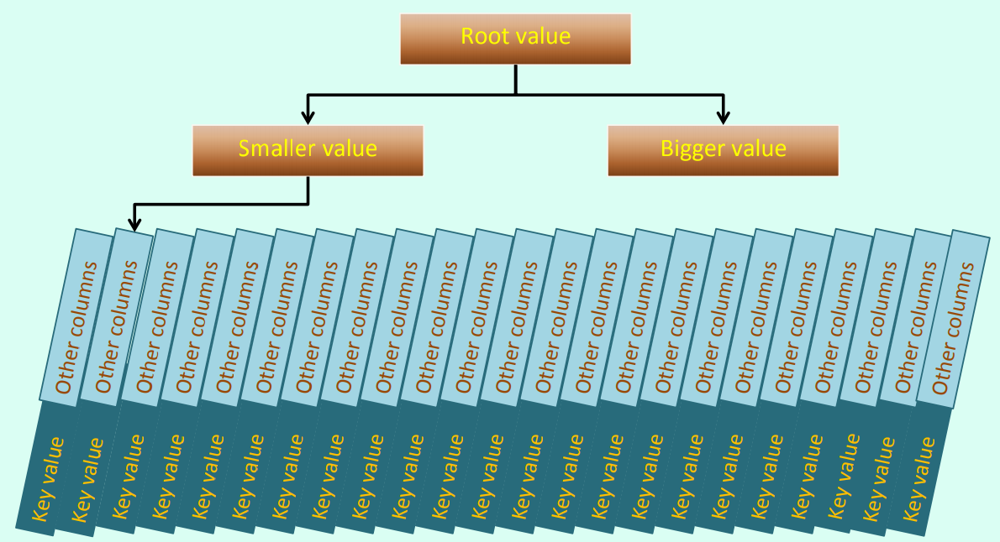

# Index 
    A sorted list of all values with their locators.  
    
### Where is the index  
    whenever you declare a PRIMARY KEY or UNIQUE constraint, an index is created behind your back.  

  
### Quickly 
    The only way to find quickly in a big table that a suppoesdlu unique value is already recorder is to index the column.


### B-Tree
**The data of the index are store in the B-tree, So when we change a data of the index, All the Tree will be Changed**

### Update
    insertion and deletion always require maintaining table AND indexes.
    updating an indexed column isn't only changing its value.    
        while update an indexed column, we isn't only change its value. The location is the same but the value has been changed 
        And for the index is a sorted list, which means its index need to sort again.


###  Storage
    Indexes use a lot of storage, sometimes more than data! It hasa huge impact on operations(like backups).

### index or constraint?
You can also declare an index to be unique
  
This can enforces unique constraint like a constraint definitation.  


**If both Unique index and Unique constraint are equivalent, then which one we should use?**  
*    Of course we choice ***Constrains***. The refer the design.
*    However, there are some rare case when uniqueness(Such as case-insensitive uniqueness in Orcale in a column in which data in mixed case) cannot be with the dirty trick(233333) of unique indexes.

### Effcient
    Index massively improve performance. Scaning a half-million row table for a unique value may take a fraction of a second, but instant if index.

But if it's just a sub-second resp[onse time is quite acceptable. It's when the same action is repeated a large number of times that will make a difference. **So just use index just when this column will be  used many times**.

### Why not index every unique  
*    The index will cost much stroage room.
*    The index column will cost more time when update the table.

### So where should we add a index?
*    You need to query this column so many times.
*    The co-lumn should be **selective**, which means that the values it contains are rare and correspond to very few rows.

### Composite indexs
*    Two or more columns are composited as a index. Like a movies in a country(movie_title and country are two column).

### Search based on the ordering(insider the tree)
*    The index serach is based on ordering（insider the tree）and the ordering is different with different datatypes.
*    The index was stored in a BTree(Balanced binary tree).



### Some Function
*    **upper()**, translate all the letters to the capital;
*    **soundex()**, translate to the sound of the word ,like soundex('please')=soundex('plz');
*    **dataname()**, get a part of a data.  
  

But for the dataname, the resukt returned by this function may be is diferent for the same data. When the language of the database change, the result will a;lso change. Like the query

```sql
select dataname(month,'1970-01-01');
```

if the language of data is english, then the result will be January， but if the language is  Spanish, then the result will be "Entro"(Means Juanuary in Spanish).
    
### Proper index usage
                *Depend a lot on how you write your queries*
* joins and subqueries can exchange. But all writings haven't the same indexing implications  
* Constraints with an eye to Performance  
    * Which brings us to another topic: when I define constrains, can I do it in a clever way?
    * Pk and unique constrains were both creating an index, to quickly check whether an entry is already known.
* For Combination of the column, like:   
    
    We will foud that the order of the combination will have influence, we can use it as our  benefit.  
* Index and ordered table
    * A regulare table(*unordered*, rows are inserted where room is found) is called a **Heap-organized table**
    * A table that is ordered is called a **Clustered index Index-organized table**
Why "index" because indexes are strongly ordered structures, and an ordered table follows the same pattern.  
In an index you find key values and row address:  

In an ordered table, row data replaces the row  address.

For internal storage reasons, it works better with few columns.


* *That way you have all rows ordered accordeing to the key value*
    * Benifit:
        * The table is an index on a key, you don't need to maintain any additional index on that key.
            You may however still have indexs on other columns, which still have to be maintained.
        * You walk nyour tree and find data, not an address requiring an access to something else.
        * When looking for a range of values, you find all them in succession. In a regular table, they may be scatted and required many I/Os.
    * Drwaback:
        * A big drawback is that if you update the key, ity's not just changing a column value, it's moving around a whole row.  
        This is why the "key" ordering everything is usuallu the **PK**, which isn't updated by definition(If you change the identifier, iyt's somethong different).
        * Inserting a row may involve shifting around a lot of bytes to make room. 
            * No issue if rows are inserted in the same order as the key, (For that the if the key is an auto-numbered column or the timestamp at insertion).
            * Big issue if the order of insertion is more or less random in reference to the key.
    * Natural Candidates for this type of prganization is table in the "tall and thin"(few column and many row), not in the "short and plump" one, and for which the key order makes some real-life sense for range scans.
    * Tables that implement a many-to-many relationship may fall into this category.
    <center ><b>Natural order </b></center>
    


