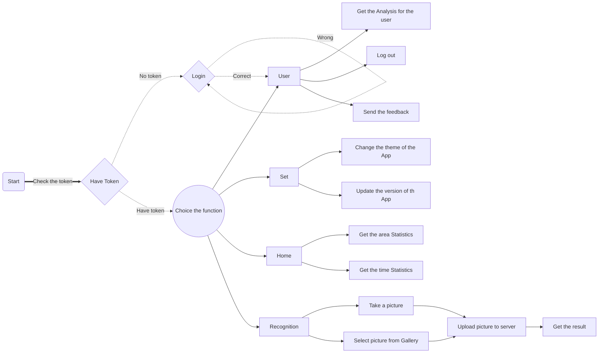

##    Total Flow Chart

```mermaid
    graph LR
    start(Start)
    haveToken{Have Token}
    login{Login}
    choicePage((Choice the function))
    user[User]
    recognition[Recognition]
    home[Home]
    set[Set]
    takePicture[Take a picture]
    selectGallery[Select picture from Gallery]
    uploadPicture[Upload picture to server]
    getResult[Get the result]

    getAnalysis[Get the Analysis for the user]
    areaStatistics[Get the area Statistics]
    timeStatistics[Get the time Statistics]
    changeTheme[Change the theme of the App]
    updateVersion[Update the version of th App]
    feedback[Send the feedback]
    logout[Log out]
    
    start  ==>|Check the token| haveToken
    haveToken -.No token.-> login
    haveToken -.Have token.-> choicePage
    login -.Wrong.-> login
    login -.Correct.-> user
    choicePage --> user
    choicePage --> set
    choicePage --> home
    choicePage --> recognition
    recognition --> takePicture
    recognition --> selectGallery
    takePicture --> uploadPicture
    selectGallery --> uploadPicture
    uploadPicture --> getResult
    home --> areaStatistics
    home --> timeStatistics
    user --> getAnalysis
    user --> logout
    user --> feedback
    set --> changeTheme
    set --> updateVersion
```

