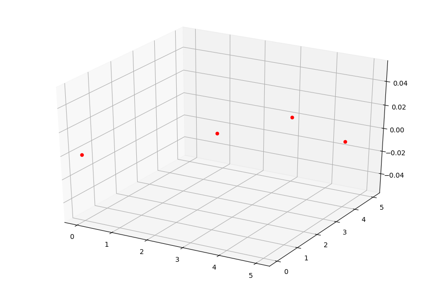
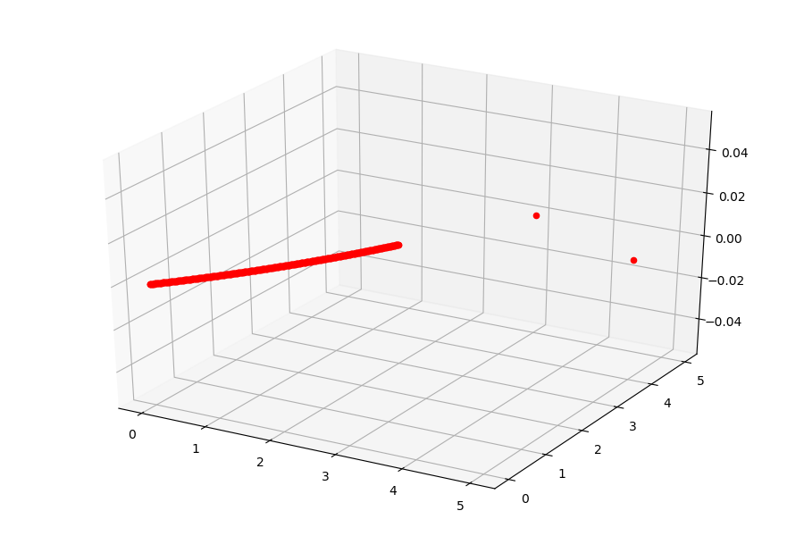
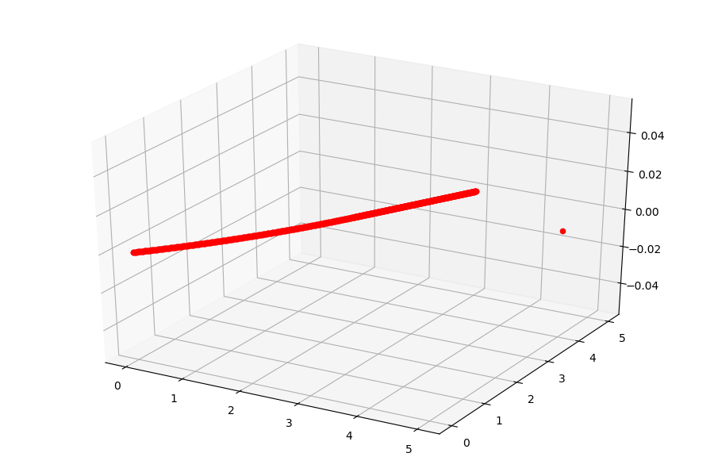
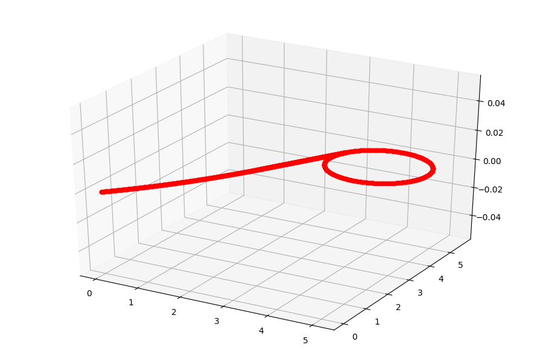

# 科创

## 路径规划部分
### 简介
在这次所进行的项目中，我们需要自动执行对摆放在三个未知的纸箱中的物体的识别，需要飞机能够自主起飞并在系统的控制下自动飞行遍历三个坐标点并对其中的内容进行识别，这就需要一个自动寻址规划的算法。同时，使用的飞机是传统固定翼的航模，而非多轴无人机，这就造成了飞机的最低飞行速度较快，转弯半径大且精度较差，无法悬停的问题。在这种情况下，想要尽可能精准的实现找到目标并作出识别，就必须要在路径规划的算法上做出一些改变。
### 基本思路
针对固定翼航模转弯半径大，且精度较差的情况，我们进行路径规划时的主要思路就是尽可能拉大转弯半径。同时，因为飞控对于固定航点寻址过程中不会严格按照弧形轨道飞行，而是采用小半径转弯+直线轨道的飞行模式，为了提升精度，每一个弯道都同样需要我们设置多个航点进行控制。

### 分段轨道
#### 确定访问次序
访问词序遵循以下两个原则：  

*    第一个目标点选定为离起点最近的一个点
*    第二个目标点需要使第一段轨道半径最大

#### 第一段轨道
第一段轨道为一个从起点开始的圆弧轨道。  
这个轨道所在的圆与第一第二个点所连成的直线相切  
圆心通过起点与第一个点之间的连线以及第二第三个点之间的连线的斜率与长度来确定。

#### 第二段轨道：
第二个点与第三个点的连线，与第一段轨道相切

#### 第三段轨道
起于第二个点的一个与第二段轨道相切且经过第三个点的圆形轨道

之所以在经过第三个点之后仍旧需要返回第二个点，是因为识别需要时间，无法立即确认投弹位置，所以绕回第二点留出缓冲时间，到达第二点后再进行投弹事宜

