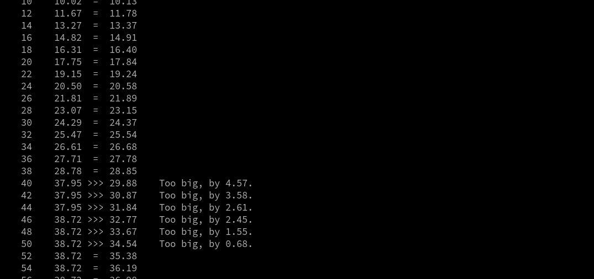
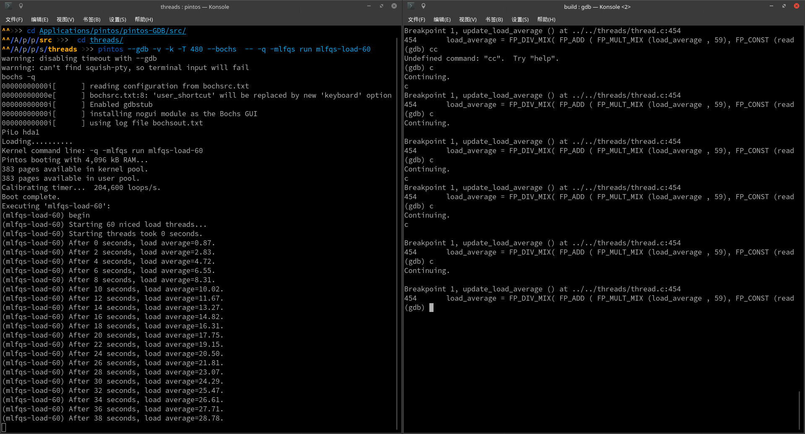
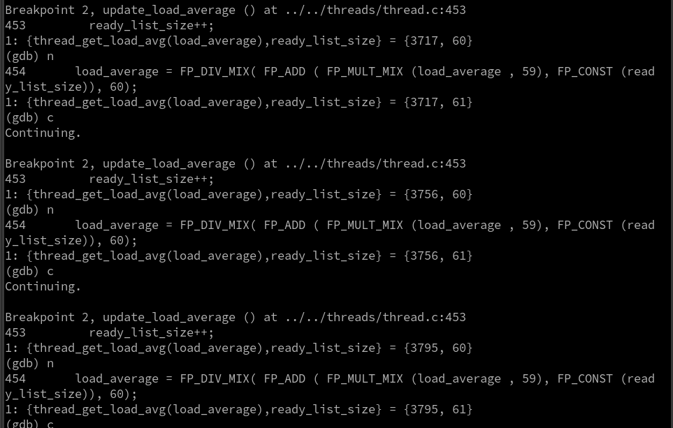
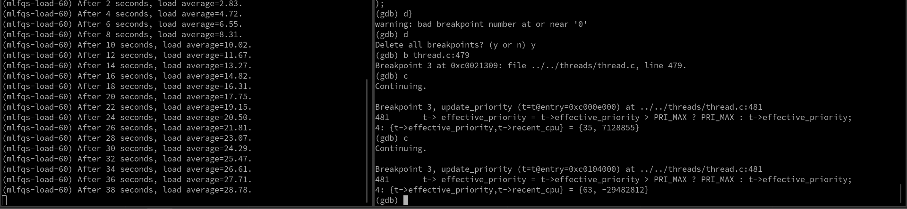
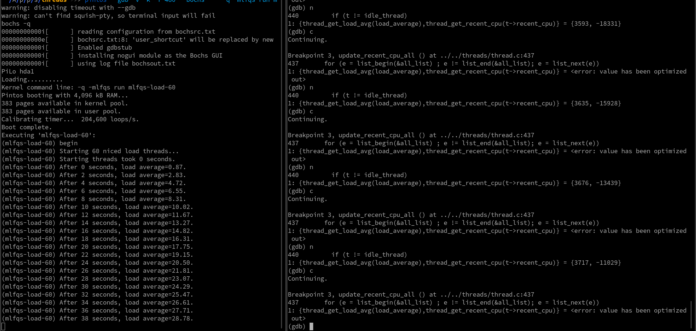
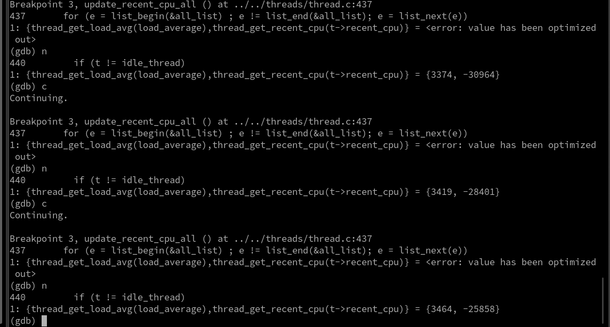
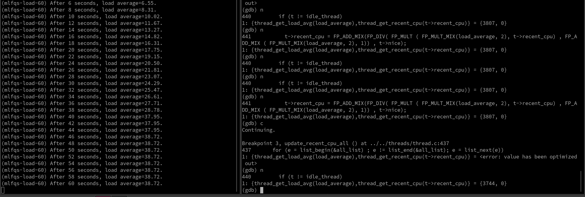
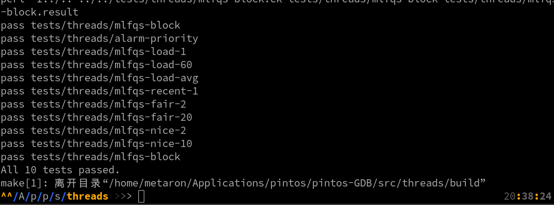

****

<center><font face="Source Code Variable" size="6">Project1: Thread Report</font></center>
<center>姓名：汪至圆 &nbsp; 学号:11610634</center>

****

#   1.  Final Report
##  Changes compare with the design document
### Task１:
For the task1, I do it follow my design document.
*   Add a member variable `sleep_ticks` in the structure thread.
*   Add a method `thread_check` which will be executed in each interrupt.
*   I choice the second way to implement this function, I will check all the threads in the timer interrupt.

### Task2:
For the task2, I do some changes from the design document.
*   The data structure will follow the design document.
*   For the functions, I add some details:
    *   Implement the donation of the priority, which haven't be considered in the design document.
        *   Donate the priority for the lock's holder.
        *   Let the holder's priority be the max value of the locks' max priority which it needed.
        *   Reinsert this thread into the ready list.
    *   Add some methods to be modular
        *   `thread_priority_donate()`
        *   `thread_update_priority()`
        *   `current_thread_get_lock()`
        *   `priority_compare()`
        *   `lock_compare()`
        *   `sema_compare()`

### Task3:
For the task3, I do some changes from the design document,
*   The data structure will follow the design document.
*   For the functions, I add some methods to be modular.
    *   `mlfqs_update_priority()`
    *   `mlfqs_increase_recent_cpu()`
    *   `mlfqs_update_load_avg_and_recent_cpu()`

### Task4:
The task4 is using gdb to debug. The work of this part isn't in the design document, and the details will be expressed in the GDB Report part.


##  Reflection:
In this project, I was driven by the ddl, time is always tight. The design work take so much time and work well. Something need to be improved is the style coding isn't consistent with the original project, so it takes me some time to format the code.


#   2.  GDB Report.
##  Analysis:
*   For this pintos, it pass 9/10 tests. And fail in the test mlfqa-load-60.
    *   
    *   From the image, we can find it get wrong load_avg in the 40 to 50 seconds.  
    *   And the reason of failed is not exception or error, it is caused by the value error of the load_avg.
*   Then, we can analysis why the load_avg was wrong.
    *   In the `update_load_average()`, we can know, the load_average depend on the size of the ready list.
    *   And the size of ready list depend on the threads' priority.
    *   The priority is depend on the recent_cpu and nice.
    *   The recent_cpu is depend on the load_average and nice.
*   So, we can know, the reason should in the calculate of the load_average, recent_cpu or the priority.
    *   `update_load_average()`
    *   `update_priority()`
    *   `update_recent_cpu_all()`

##  Debug
### Use gdb:
In this part, I will use gdb to debug.
*   Use `b [break point]` to set break point
*   Use `p [value]` to print the value want to know
*   Use `display [value]` to print the value want to know each execution
*   Use `d [index]` to delete the break points
*   Use `d d [index]` to delete the display
*   Use `{value1,value2,...}` to combine the value
*   For the value we can call the method in the program
    *   eg. `display {thread_get_load_avg(load_average),ready_list_size}` 

### Debug process
*   Test the load_average
    *   Use break points, continue until time to 38 seconds:
    *   
    *   
    *   The result looks no problem.
*   Test the priority
    *   Use the break points, continue until time to 38 seconds:
    *   
    *   The value of the priority looks no problem, but the recent_cpu looks not good.
*   Test the recent_cpu
    *   Then, I will run the pintos for the 3rd, to test the problem about the recent_cpu.
    *   
    *   
    *   
    *   From the two pictures above we can find:
        *   The recent_cpu in 38 second become negative
        *   And when time large than 60, it become zero.
        *   The recent_cpu is not correct.
*   From above, we can know the result of calculating for priority and load_average looks very normal, and the result of calculating for recent_cpu appear some exception.
*   Then, we can have a look for the formula of the recent_cpu.
```C
 t->recent_cpu = FP_ADD_MIX(FP_DIV( FP_MULT ( FP_MULT_MIX(load_average, 2), t->recent_cpu) , FP_ADD_MIX ( FP_MULT_MIX(load_average, 2), 1)) , t->nice);
```
*   Translate to the math formula, it is: $recent\_cpu=\frac{2\times load\_average\times recent\_cpu}{2\times load\_average+1}+nice$.  
*   It looks no difference from the formula given by the pdf, but in this formula, it multiply the recent_cpu and load_average firstly, which will cause the value overflow. 
*   So, we need do it follow$recent\_cpu=\frac{2\times load\_average}{2\times load\_average+1}\times recent\_cpu+nice$.
*   The code should be:
```C
 t->recent_cpu = FP_ADD_MIX(FP_MULT(FP_DIV(FP_MULT_MIX(load_average, 2),  FP_ADD_MIX(FP_MULT_MIX(load_average, 2), 1)),t->recent_cpu), t->nice);
```
*   
