---

Lab 8

姓名：汪至圆 &nbsp; 学号:11610634

---

# Fundamental:

## 1.What is Uniprogramming:

- Have no translation or protection
- Application always runs at same place in physical memory since only one application at a time.
- Application can access any physical address
- Application given illusion of dedicated machine by giving it reality of a dedicated machine
- There are just two program in the memory, OS and user Application.

## 2.What is the shortcoming of Uniprogramming:

- All of the program need to be load into the memory.
- Just run one program, this waste the resource.
- May can't run under in the different OS.

## 3.What is Multiprogramming:

- Also no translation or protection
- Allocate resource to more than one Application.

## 4.What is the shortcoming of Multiprogramming:

- Bugs in any program can cause other programs to crash or even the OS;
- Will produce fragmentation

## 5.What is the segmentation mechanism and its advantages & disadvantages:

- Segmentation:
  - Division of a computer's primary memory into segments.
  - Logical View: multiple separate segments
    - Typical: Code, Data, Stack
    - Others: memory sharing, etc
- Advantages:
  - Make data more “logical”
  - We can do much better on “protection”
  - Reduce fragmentation
- Disadvantages:
  - As processes are loaded and removed from the memory, the free memory space is broken into little pieces, causing External fragmentation.
  - Must fit variable-sized chunks into physical memory
  - May move processes multiple times to fit everythin-=
  - Limited options for swapping to disk

## 6.What is the paging mechanism and its advantages & disadvantages:

- Paging:
  - Allocate physical memory in fixed size chunks (“pages”), Every chunk of physical memory is equivalent.
- Advantages:
  - Simple to implement
  - Reduce external fragmentation
- Disadvantages:
  - Page table requires extra memory space
  - Suffer from internal fragmentation

# Memory management(based on the code):

## 1.What kind of data structure is the memory block used for storage?

- LinkedList

## How to reduce the occurrence of internal fragmentation when allocating memory? Briefly explain why this method works.

- Reduce the MIN_SLICE, which decide the the size the allocted_blocked more than the size it required.

## What kind of strategy does the original program take to allocate memory? Briefly describe the benefits of doing so.

- First-Fit:
  - A chunk of data is put in the first available block of memory that is big enough for the data to fit.
- Best-Fit:
  - A chunk of data is put into the absolutely smallest available block of memory that can still fit the data.
- Worst-Fit:
  - A chunk of data is put into the largest available block of memory. This is the opposite of the Best-Fit algorithm

# Code result, screenshot and your comments:
## Test1:
*    Change mem_size:
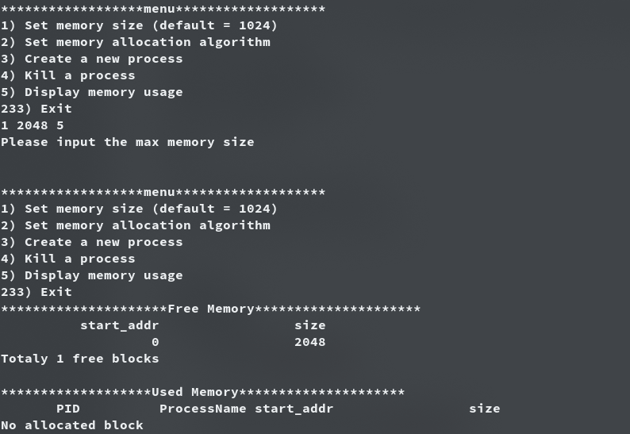
*    Cteate Process:

*    Delete Process:
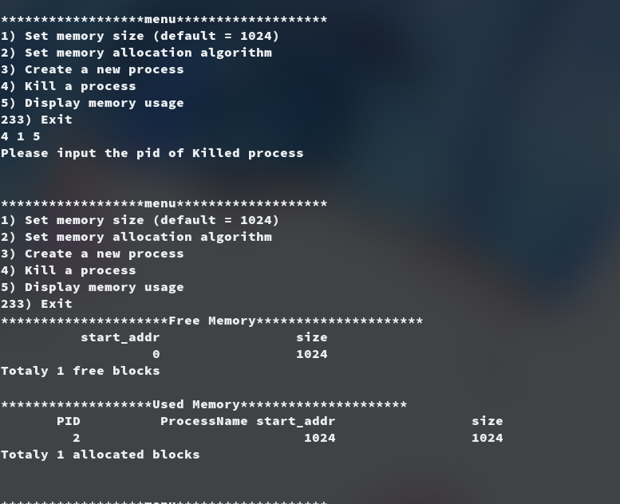
*    Delete Process:
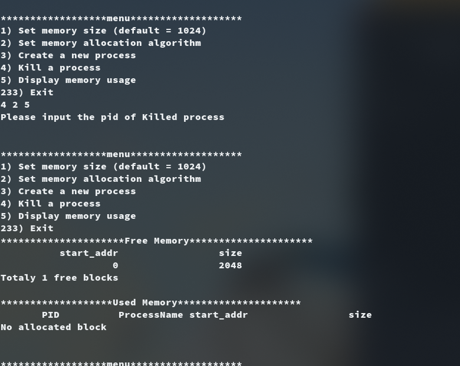
*    Exit

##    Test2
*    Create Process:

*    Create Process(Failed, memory is not enough)
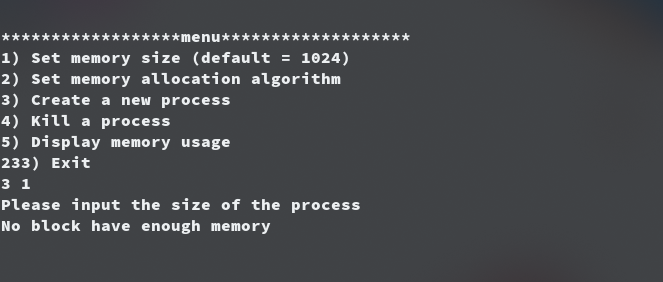
*    Delete Process:
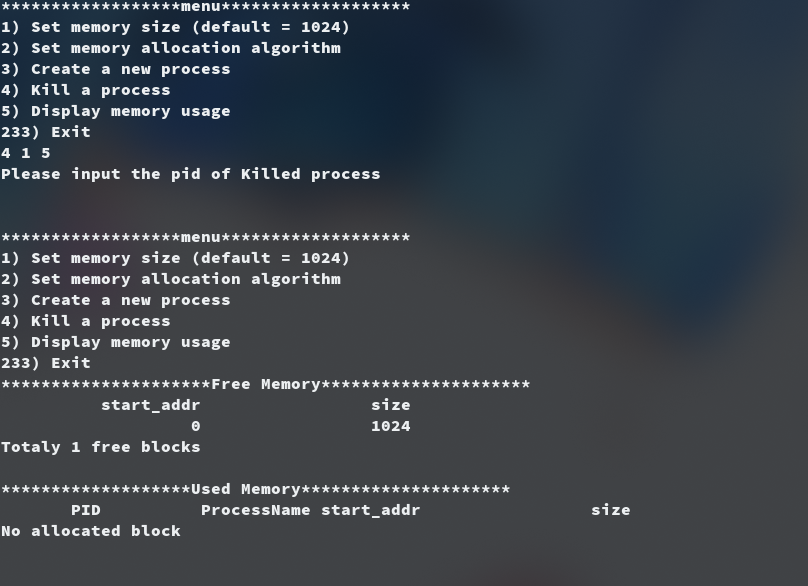
*    Delete Process(Failed, No that Process)
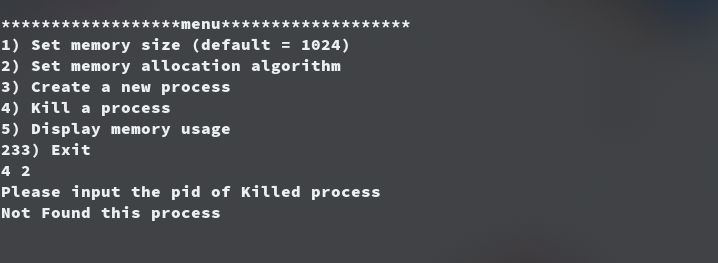
*    Exit

##    Test3:
*    Set mem_size:
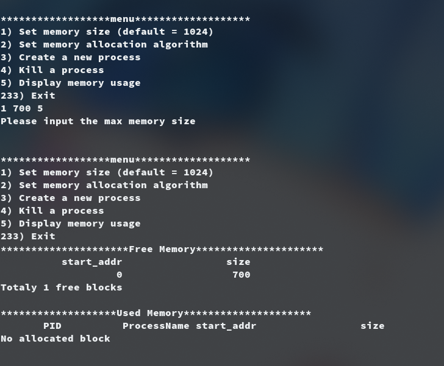
*    Create process:
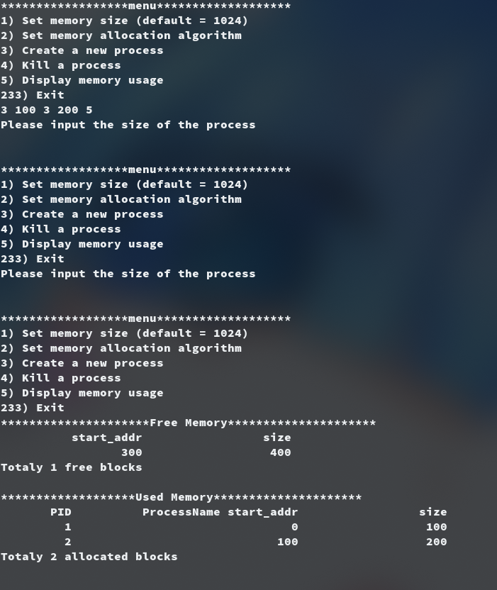
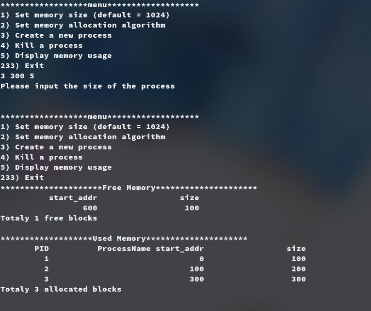
*    Delete Process
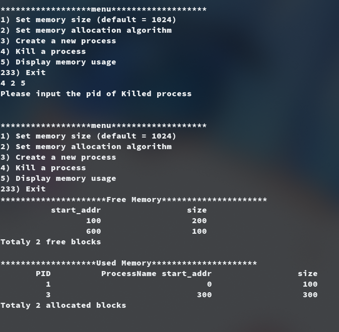
*    Create Process(Failed, No enough memory)
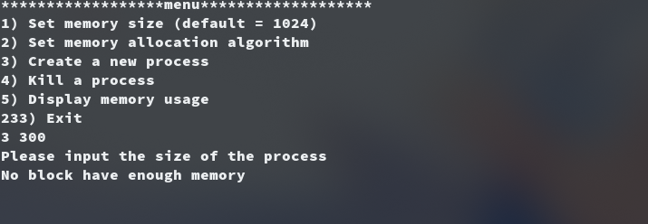
*    Delete Process:
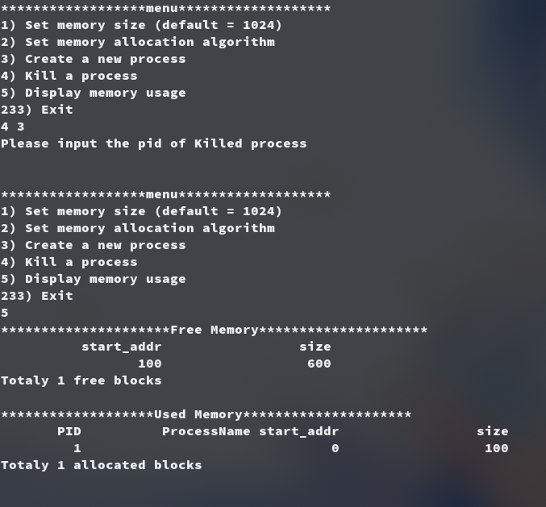
*    Exit

##    Test by myself for best_fit and worst_fit:
*    Change to best_fit:
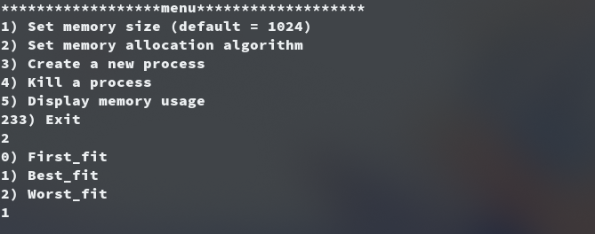
*    Create Process:
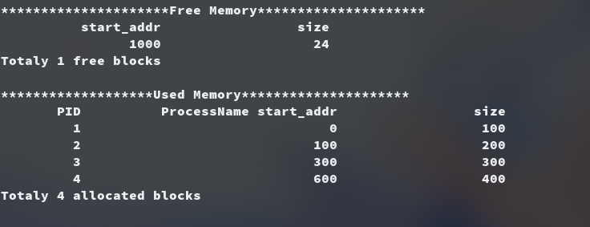
*    Delete Process:
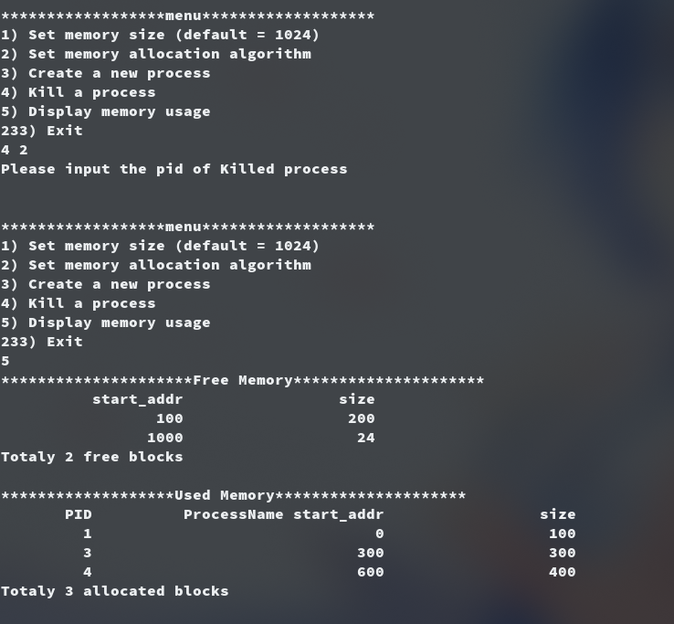
*    Create Process

*    Change to worst_fit:
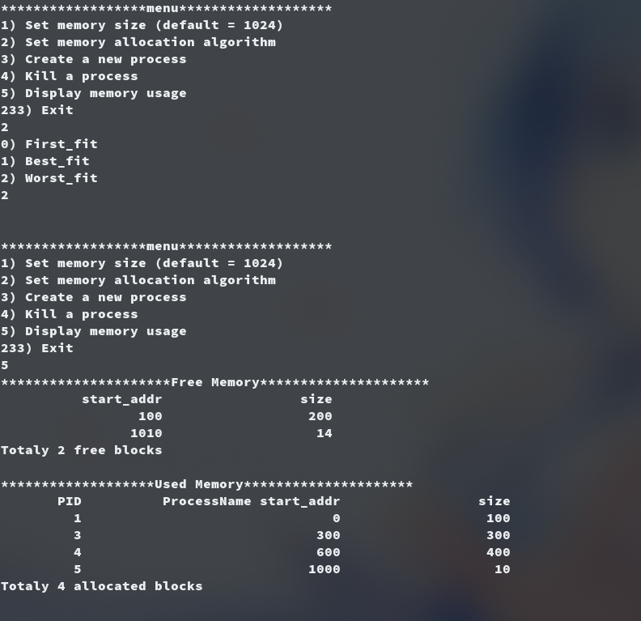
*    Delete process:
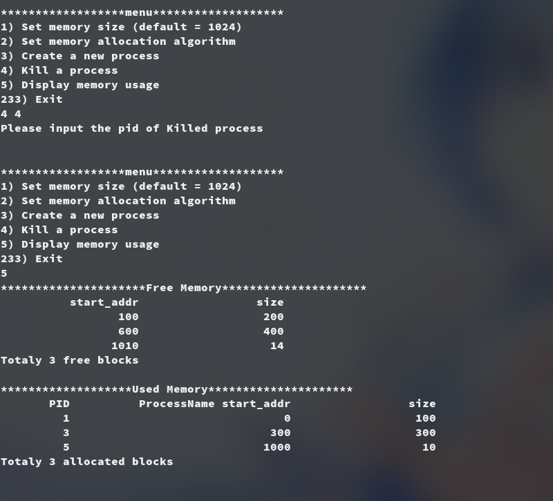
*    Create Process:
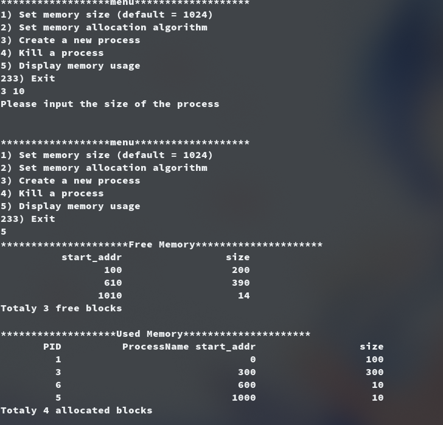