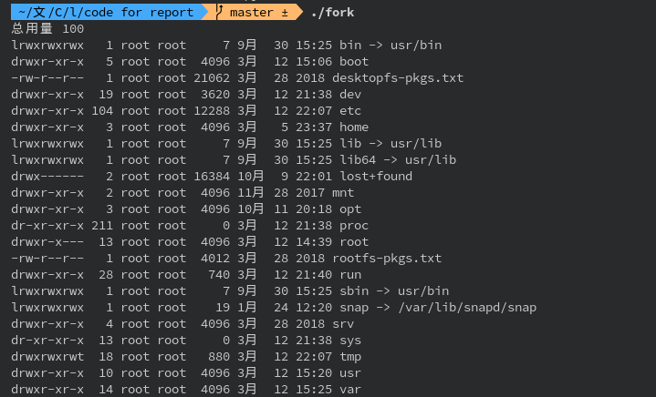
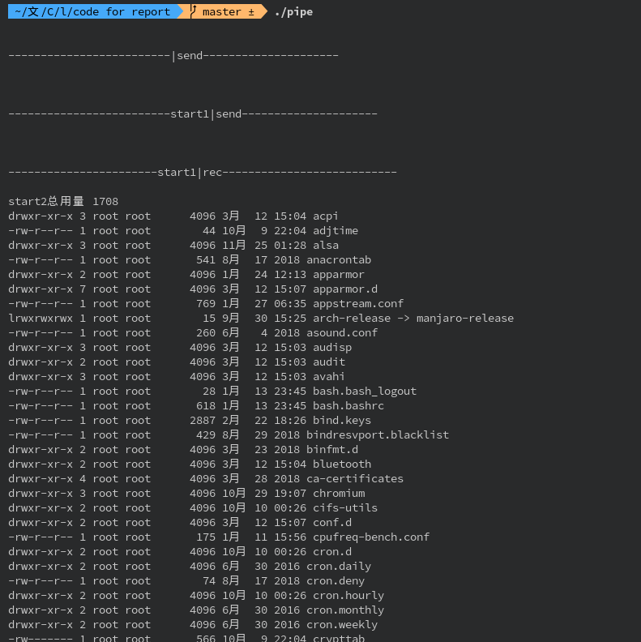
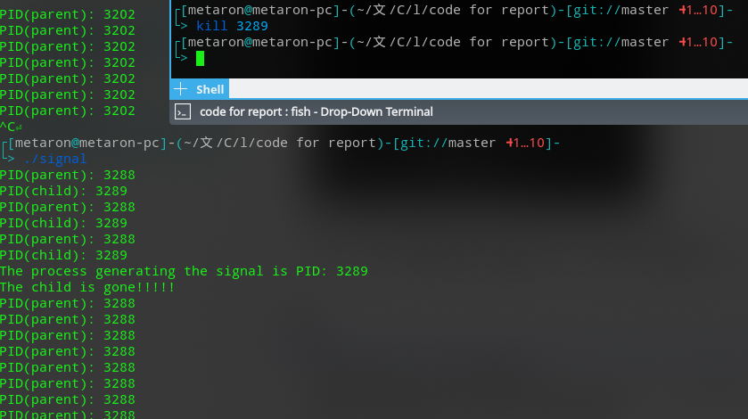
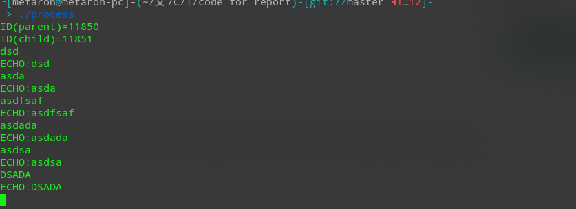
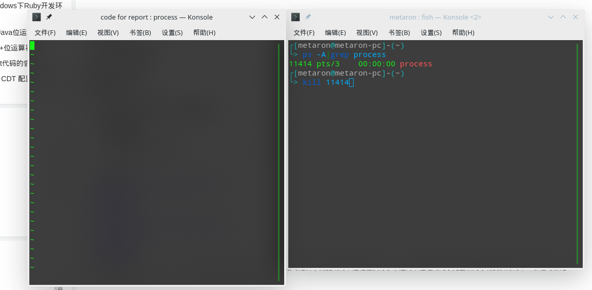
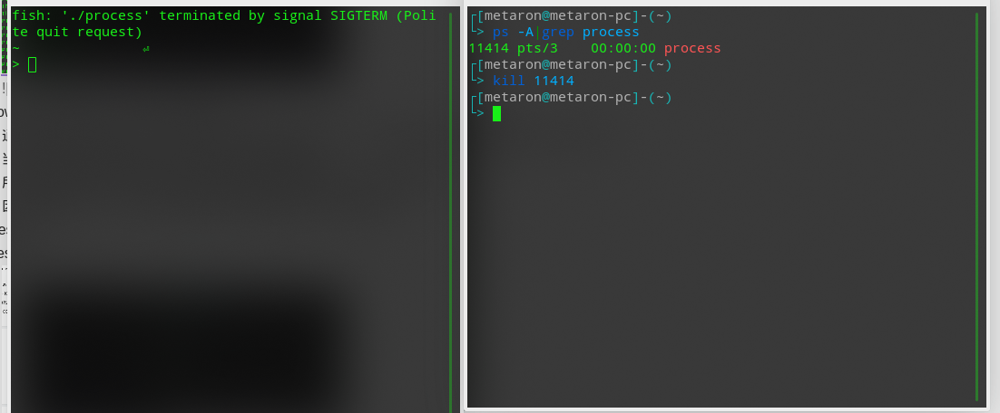
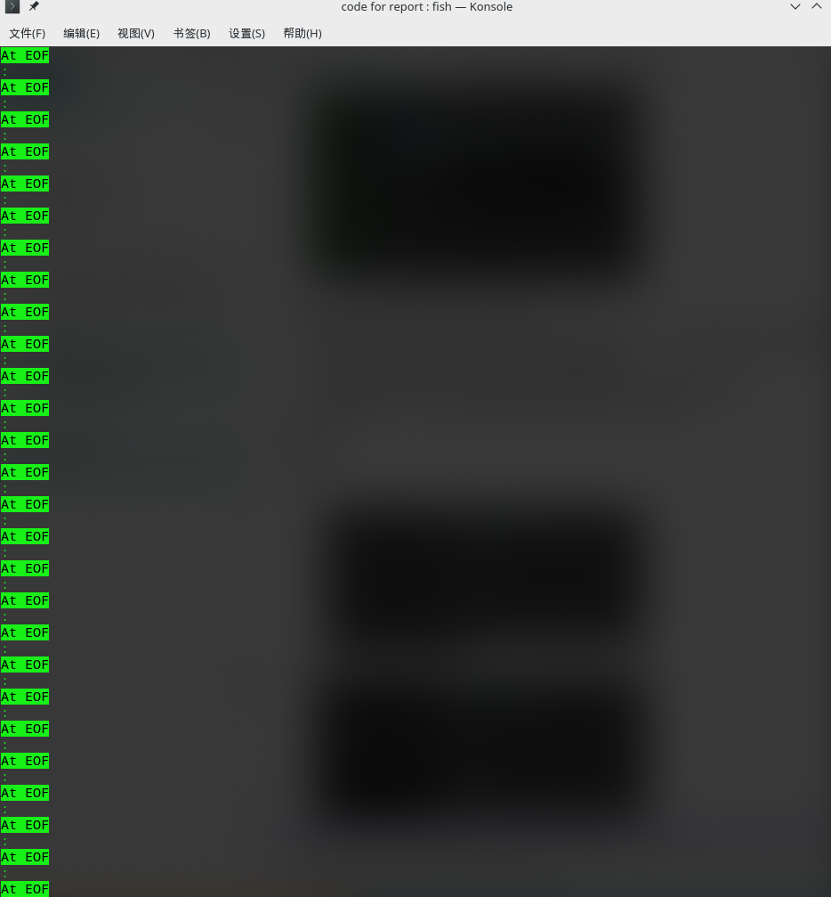

****

<center><font face="Arial" size="6">Lab 2</font></center>
<center><p>姓名：汪至圆 &nbsp; 学号11610634</p></center>

#   Experiments:
##  1. fundamental：
*   What is a system call:
    *   System Call is an API which is realize by the Operating System, is the interface between the operating system and the application.
*   What is fork:
    *   Fork will create a child process, which is like the current process. That means most of the values of these process are same. 
*   How to realize inter-process communication:
    *   pipe
    *   message queue
    *   signal
    *   shared memory
    *   socket
*   How to realize inter-process connection:
    *   Use pipe, including Ordinary Pipes, Named Pipes.
##  2、 Write the prototype of the following functions:
*   fork:
    ``` C
    #include <unistd.h>
    pid = fork()
    ret = waitpid(pid)
    ret = wait();
    ```
*   signal:
    ``` C
    #include <signal.h>
    void (*signal(int sig, void (*func)(int)))(int);
    ```
*   pipe:
    ```C
    #include <unistd.h>
    int pipe(int fildes[2]);
    ```
*   tcsetpgrp:
    ```C
    #include <unistd.h>
    pid_t tcgetpgrp(int fd);
    int tcsetpgrp(int fd, pid_t pgrp);
    ```

##  3、Execute and observe
*   fork.c
    *   Result:
        *   
    *   How to distinguish between parent and child processes in a program:
        *  通过PID来进行区分, 判断当前运行的PID是否为0就可以区父子进程.
                                                                             

*   pipe.c
    *   Result: 
        *   
    *   Is execvp(prog2_argv[0],prog2_argv)(Line 56) executed? And why? :
        *   执行了， 从程序的结构以及输出结果可知， 首先由父进程创建两个子进程， 并在第二个子进程中执行这一命令， 

*   signal.c
    *   Result:
        *   
    *   How to execute function ChildHandler? :
        *   通过使用sigaction structure来将ChildHandler注册为一个信号处理函数, 并将其指向SIGHLD信号
        *   当SIGHLD信号被触发时, ChildHandler将会被调用
        *   所以想要执行ChildHandler函数, 需要父进程收到SIGHLD即子进程exit()
        *   因此可以在另一个terminal执行kill child-pid来excute这个函数
*   process.c
    *   Result:
        *   
        *   
        *   
        *   
    *   How many ./process in the process list? And what’s the difference between them?:
        *   Two ./process, one is the main process, and the second one is the child process of the first one, their pid is different.
    *   What happens after killing the main process:
        *   Kill 掉main process之后, 会发现子进程中调用的vi并没有被终止, 同时, 如果此时在shell中输入字符, 会开始报错 AT EOF. 