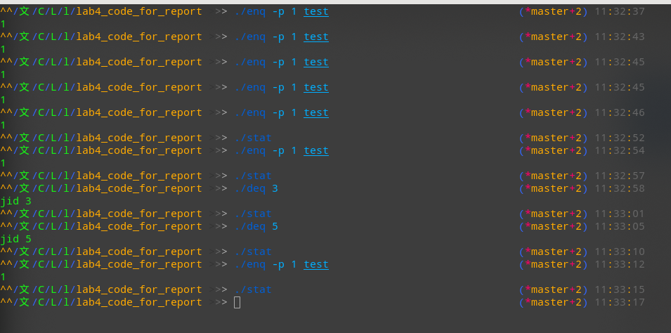
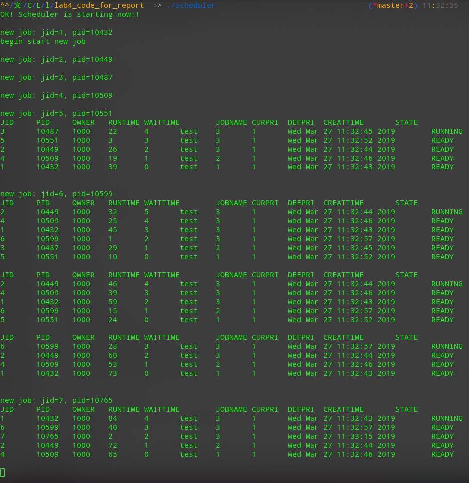

****

<center><font face="Arial" size="6">Lab 4</font></center>
<center>姓名：汪至圆 &nbsp; 学号:11610634</center>

****

#   Experiments:
##  1.Fundamental: 
*   **What is a process? What is a program? And what is the difference?**
    *   Process is a program in execution with its own pid and address space. 
    *   Program is the instructions that storage in the disk.
    *   The difference is the process is storaged in the memory and is in execution, the program is storaged in the disk and isn’t in excution.    
*   What is job? And what is the difference between process and job?
    *   Job is a unit of work or unit of execution, which is a serial of process submitted to the OS.
    *   A job can have one or many process.
*   What are the differences between job scheduling and process scheduling? 
    *   Processing scheduling schdule a current process
    *   Job scheduling choice the **program** that need to be executed
    *   CPU scheduler is faster than job schduler
*   What are the similarities and differences among structures, classes, and unions in C language：
    *   Similarities: They are both can define a value type.
    *   Difference:
        *   Structure: Define a structure that combine some variables and define its operation
        *   Class: Like the structure. But the member of the class variable is private in default which is public in structure.
        *   Unions: It storage different kind of datastructure variable, but it just have one value of them in the current time.

##  2. Knowledge: 
*   How many states are in a job? And what are they?
    ```C
    enum jobstate 
    {
        READY, RUNNING, DONE
    };
    ```
    *   READY
    *   RUNNING
    *   DONE
*   What programs are used in this experiment for job control? And their function? 
    *   Scheduler.c: Create a process fora new job. Set its state to READY and put it in the waiting queue. It will hander the request of dequeue and show the status
    *   Enq.c: Send enqueue request to Scheduler
    *   Deq.c: Send dequeue request to Scheduler
*   What is used for inter-process communication in this experiment? And its function?
    *   Signal
    *   

##  3. Questions:
*   What should be noted when printing out the job name: 
    *   We need to print the cmdarg[0]

*   Submit a job that takes more than 100 milliseconds to run:
    *   Write a program with a loop block
    ```C
    while(1){

    }
    ```
    *   Use enq to add it into the queue.
        ```Shel
        ./env -p 1 test
        ```
    

*   List the bugs you found and your fix (code and screenshot): 
    *   In the 85th line of the scheduler.c: ';'->'；'
    *   In the main() of scheduler.c:
        ```C
            interval.tv_usec = 100;
        ```
        Change to
        ```C
            interval.tv_usec = 100000;
        ```
    *   Cannot add more than 3 jobs
        *   I change the do_deq() and jobselect() function, the value of head shouldn't change to the **NULL**, but the **select->next**
            ```C
            void do_deq(struct jobcmd deqcmd)
            {
                int deqid,i;
                struct waitqueue *p,*prev,*select,*selectprev;
                
                deqid = atoi(deqcmd.data);
                
            #ifdef DEBUG
                printf("deq jid %d\n",deqid);
            #endif
                
                /* current jodid == deqid, terminate current job */
                if (current && current->job->jid == deqid) {
                    
                    printf("terminate job: %d\n", current->job->jid);
                    kill(SIGTERM, current->job->pid);
                    
                    for (i = 0; (current->job->cmdarg)[i] != NULL; i++) {
                        
                        free((current->job->cmdarg)[i]);
                        (current->job->cmdarg)[i] = NULL;
                    }
                    
                    free(current->job->cmdarg);
                    free(current->job);
                    free(current);
                    
                    current = NULL;
                    
                } else {  /* maybe in waitqueue, search it */
                    select = NULL;
                    selectprev = NULL;

                    if (head) {
                        for (prev = head, p = head; p != NULL; prev = p, p = p->next) {
                            if (p->job->jid == deqid) {
                                select = p;
                                selectprev = prev;
                                break;
                            }
                        }			

                        selectprev->next = select->next;
                        if (select == selectprev)	head = select->next;
                    }

                    if (select) {
                        for (i = 0; (select->job->cmdarg)[i] != NULL; i++) {
                            free((select->job->cmdarg)[i]);
                            (select->job->cmdarg)[i] = NULL;
                        }

                        free(select->job->cmdarg);
                        free(select->job);
                        free(select);
                        
                        select = NULL;
                    }
                }
            }
            ```
            ```C
            struct waitqueue* jobselect()
            {
                struct waitqueue *p, *prev, *select, *selectprev;
                int highest = -1;
                int longest = -1;//Set to compare the waittime
                select = NULL;
                selectprev = NULL;
                
                if (head) {
                    for (prev = head, p = head; p != NULL; prev = p, p = p->next) {

                        if (p->job->curpri > highest) {
                            select = p;
                            selectprev = prev;
                            highest = p->job->curpri;
                            longest=p->job->wait_time;
                        }
                        else if(p->job->curpri==highest){
                            if(p->job->wait_time>longest){
                                select=p;
                                selectprev = prev;
                                highest=p->job->curpri;
                                longest=p->job->wait_time;
                            }
                        }
                    }		

                    selectprev->next = select->next;

                    if (select == selectprev) head = select->next;
                }
                
                return select;
            }
            ```
*   Run the job scheduler program and analyze the execution of the submitted job:
    *   The input of the enq, deq and stat:
          
    *   The Output from scheduler:  
        ;


*   Understand the process of job scheduling: (Execution results and corresponding code):
    *   Submit a new job： 
        *   Construct a new node of `waitqueue` and add it into the ready list. Then fork a new process.
            ```C
            /* add new job to the queue */
	
            newnode = (struct waitqueue*)malloc(sizeof(struct waitqueue));
            newnode->next = NULL;
            newnode->job = newjob;
            
            if (head) {
                for (p = head; p->next != NULL; p = p->next);

                p->next = newnode;
            } else
                head = newnode;
            
            /* create process for the job */
            
            if ((pid = fork()) < 0)
                error_sys("enq fork failed");
            
            /* In child process */
            
            if (pid == 0) {
                
                newjob->pid = getpid();
                
                /* block the child wait for run */
                
                raise(SIGSTOP);
            ```

    *   End of job execution:
        *   Clear the job and free its memory.
            ```C
            	if (current && current->job->state == DONE) {           /* current job finished */
		
                    /* job has been done, remove it */
                    for (i = 0; (current->job->cmdarg)[i] != NULL; i++) {
                        free((current->job->cmdarg)[i]);
                        (current->job->cmdarg)[i] = NULL;
                    }

                    free(current->job->cmdarg);
                    free(current->job);
                    free(current);
                    
                    current = NULL;
                }
            ```

    *   Job scheduling due to Priority:
        *   The job which have highest priority will be selected by **next**, it will run in the next **jobswitch()** call.
            ```C
            for (prev = head, p = head; p != NULL; prev = p, p = p->next) {

                if (p->job->curpri > highest) {
                    select = p;
                    selectprev = prev;
                    highest = p->job->curpri;
                    longest=p->job->wait_time;
                }
                else if(p->job->curpri==highest){
                    if(p->job->wait_time>longest){
                        select=p;
                        selectprev = prev;
                        highest=p->job->curpri;
                        longest=p->job->wait_time;
                    }
                }
            }	
            ```

    *   Job scheduling due to time slice: 
        *   When many jobs have the same priority, the job which have the longest waitime will be selected by **next**, it will run in the next **jobswitch()** call.
            ```C
            for (prev = head, p = head; p != NULL; prev = p, p = p->next) {

                if (p->job->curpri > highest) {
                    select = p;
                    selectprev = prev;
                    highest = p->job->curpri;
                    longest=p->job->wait_time;
                }
                else if(p->job->curpri==highest){
                    if(p->job->wait_time>longest){
                        select=p;
                        selectprev = prev;
                        highest=p->job->curpri;
                        longest=p->job->wait_time;
                    }
                }
            }	
            ```    