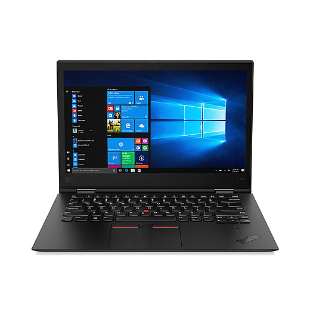
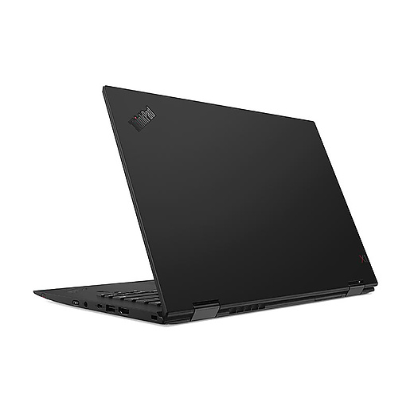
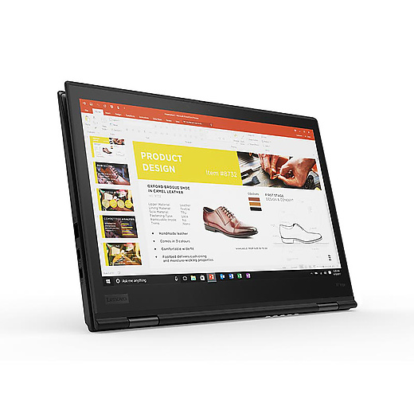
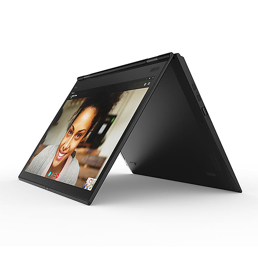
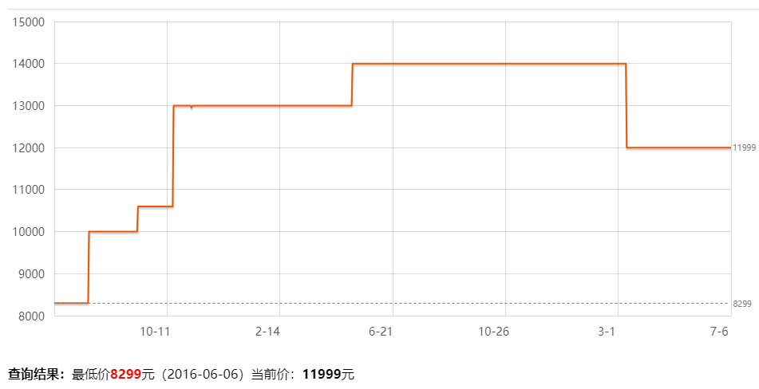

# ThinkPad X1 Yoga 2018（0KCD）
*作者： 菜球*
### 外观图赏（来源官网）
    
 

### 价格走势（来源京东）

### 配置详情
* CPU:  
    * i5 8250U  
    * 四核八线程  
    * 基频1.6GHz, 可睿频至3.4GHz  
    * 6MB三级缓存  
    * TDP 30W
* 内存：  
    * 8GB LPDDR3  
    * 板载 不可升级，不可加装  
* 硬盘：  
    * 256G PCIe固态
    * 可升级不可加装  
* GPU:  
    * Intel UHD620  
    * 共享内存  
* 显示器：
    * 14寸 16:9 1080P
    * 72% NTSC, 约90-95%srgb覆盖
    * 最高4096级压感屏幕
    * 配备有源式触控笔
* 机身接口
    * ThunderBolt 3 * 2, USB 3.0 Type-A * 2, 全尺寸HDMI * 1,
    * MicroSD卡槽 * 1, MicroSim卡槽 * 1；
    * MINI RJ45
* 通信
    * 该版本默认无WWAN卡，如需4G功能许自行加装（与X1C一样，未预留天线，需要自行安装）
    * 网卡为intel 8265AC， 高速稳定
* 续航
    * 54Wh电池，略逊于X1C，但轻度使用熬过一天还是可以的
* 其他
    * ThinkShutter 摄像头有一个滑盖，可以物理防偷窥
    * 超窄屏幕边框
    * 碳纤维顶盖，镁铝合金机身（覆盖有类肤涂层，不会冬天冻手，高负载烫手）
    * 指纹识别
    * 呼吸键盘 键盘的高度会随着屏幕角度变化而变化，防止误触
            

### 个人评价
**和X1C一样，首先，在评价这款本子之前，我想纠正大家一些观点。买电子产品从来不是只买CPU和显卡，电脑如此，手机亦如是。评价一个产品价格高低看的应该是整体的做工和设计水平以及各零部件的水准。这一段话不是为了这一台本子而说，而是为所有商务本而说。**
##### 优势
1. 优良的做工与拓展性，标杆级的商务本产品
2. 可翻转屏幕+4096级有源式压感触控，日常功能拥有更多的扩展性功能
3. 键程较X1C略有下降，但键盘手感依旧出色
4. 轻薄便携，续航出色

##### 劣势
1. 国行价格较高，有条件买到美行八通道或者港行学生机的不推荐买国行
2. 扩展性不如X1C(缺少原厂扩展坞支持)
3. 便携性不如X1C
3. 贵，但这是我们的缺点

##### 与X1C的同门竞争
同属于X1系列，X1C更像是一台正代机器，传统而极致，将传统商务本做到了极致。  
而yoga则是一个支线系列，主打的是功能性，翻转屏幕与4096级有源式压感触控是yoga最大的优势。  
这也是为何yoga在比X1C重，厚，续航、散热和电池略逊一筹的情况下还能卖的更贵的原因。   
如果你需要一台可以360度翻转，手写记笔记，同时做工精致，散热海星，拥有极佳键盘手感和可靠质量的笔记本，同时对预算没有那么敏感的话，X1 yoga是你最好的选择。或许你需要更大的硬盘，但不必担心，这都是可以后期自行更换的，如果你想要更大的内存和更好的屏幕(最高可支持2k, 100%adobe色域)，那可能需要多花一些钱，但总体还是值得的。

