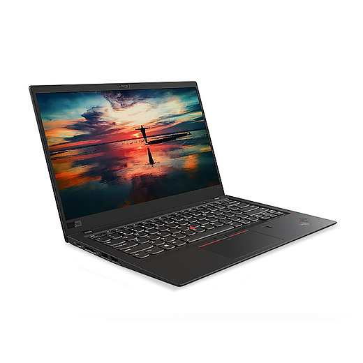
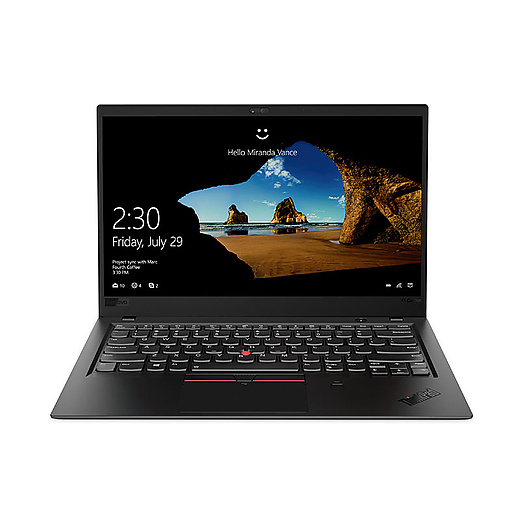
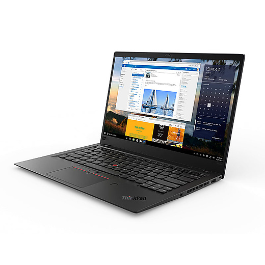
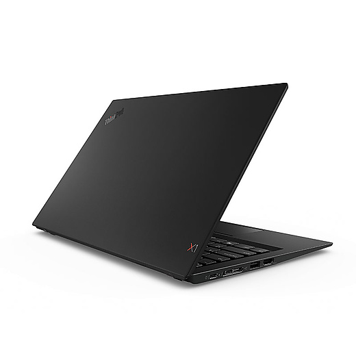
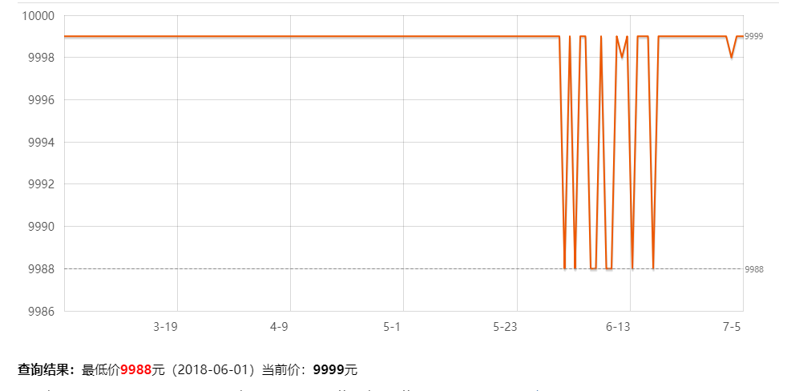

# ThinkPad x1 Carbon 2018（09CD）
*作者：菜球*
### 外观图赏（来源官网）

  
  

### 价格走势（来源京东）

配置详情：
* CPU:  
    * i5 8250U  
    * 四核八线程  
    * 基频1.6GHz, 可睿频至3.4GHz  
    * 6MB三级缓存  
    * TDP 30W
* 内存：  
    * 8GB LPDDR3  
    * 板载 不可升级，不可加装  
* 硬盘：  
    * 256G PCIe固态
    * 可升级不可加装  
* GPU:  
    * Intel UHD620  
    * 共享内存  
* 显示器  
    * 14英寸 16:9 1080P FullHD  
    * 雾面屏，防眩光  
    * 72% ntsc， 约90-95% sRGB覆盖  
* 机身接口  
    * ThunderBolt 3.0 * 2  
    * USB 3.0 Type-A * 2  
    * 全尺寸 HDMI  
    * 满速microSD卡槽，microSim卡（需要额外加装4GWWAN模块与天线）
    * 全新一代ThinkPad 扩展坞，从80一代起，ThinkPad 抛弃了从40到70这四代T,X,P系列机器上使用的扩展坞接口以及X1系列曾经使用的OneLink扩展坞，而改用了全新的统一的侧边栏扩展坞。  
* 通信  
    * 该版本默认无WWAN卡与4G天线，如需加装较为不便（相比之下，T480s默认预留天线，只需安装WWAN卡）  
    * 网卡为Intel 8265AC, 高速稳定  
* 续航
    * 57Wh电池。省着点用基本满足一天使用
* 其他
    * ThinkShutter 摄像头有一个滑盖，可以物理防偷窥
    * 超窄屏幕边框
    * 碳纤维顶盖，镁铝合金机身（覆盖有类肤涂层，不会冬天冻手，高负载烫手）
    * 指纹识别
    * 可选配红外摄像头，以及NFC

### 个人评价：
**首先，在评价这款本子之前，我想纠正大家一些观点。买电子产品从来不是只买CPU和显卡，电脑如此，手机亦如是。评价一个产品价格高低看的应该是整体的做工和设计水平以及各零部件的水准。这一段话不是为了这一台本子而说，而是为所有商务本而说。**
##### 优势
1. Windows 阵营毫无争议的标杆级商务本系列  
2. 祖传键盘手感极其出色乃至于找不到一个能打的  
3. 轻薄便携，能源管理出色  
4. 屏幕表现中规中矩，符合乞丐款的定位，雾面屏实际使用时在强光下观感依旧良好  
5. CPU的功耗强与温度墙不像上一代那么保守，性能释放充分  
6. 日常使用安静，温度很低，同时续航表现出色  
7. ThinkPad祖传的稳定耐艹  
8. 颜值高。或许是五年来最好看的TP  
9. 将一台14寸的笔记本做到了只有1.1kg重，同时不仅保证了键盘键程还塞进去了57Wh的电池，2个雷电3，2个标准USB3.0，一个全尺寸HDMI，一个满速的SD卡槽。同时机身内部还有可拆卸的ssd位，WWAN位，以及无线网卡位。在实现超窄边框的同时还支持了2 * 2的千兆WIFI天线， 4 * 4的4G天线。做到以上的同时还要防泼溅，防跌落，耐高低温。设计水准，制造水准可以说都是绝对的顶尖水平。

#### 劣势  
1. 国行价格虽然挺可以了，但是相对美行港行价格而言较高，有条件买到美行八通道或者港行学生机的不推荐买国行  
2. 和同门的T480s相比优势其实并不明显，后者拥有更强大的性能释放和原生接口扩展，重量和体积上的差距其实也没有那么明显  
3. 贵，不过我觉得这是我们的缺点。  

##### 升级建议
* 如果你只是想要更大的硬盘，那完全可以买这一款，买回来后如果不够用自行更换便是
* 如果想要更大的内存，那只有选择更高配的选项，因为内存是板载的
* 如果想要更好的屏幕，可以选择自行淘宝更换（有一定风险）。同样特可以选择更高的配置，最高可支持2k分辨率 100%adobe色域，杜比认证的HDR屏幕。

